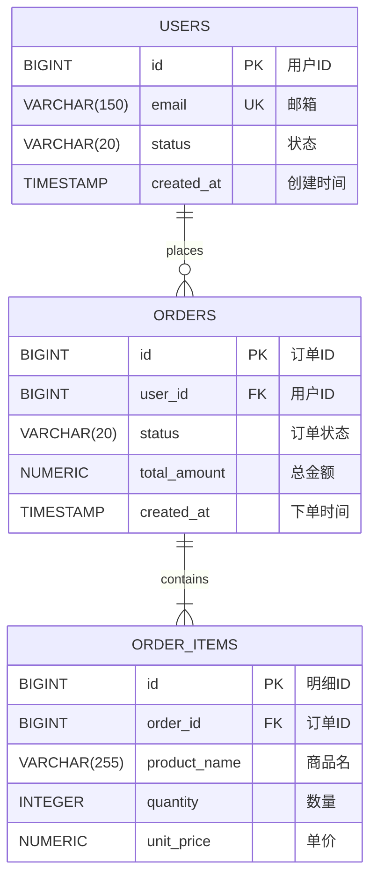

# 数据库表结构定义与关系管理

本文档展示了核心业务表的 YAML 定义及其对应的 Mermaid ER 关系图。

## 📊 表关系可视化 (Mermaid ER Diagram)

## 📝 YAML 定义示例

### 1. Users 表 (用户中心)
参考文件：[schema_users.yaml](./schema_users.yaml) | [schema_users.json](./schema_users.json)

### 2. Orders 表 (订单主表)
参考文件：[schema_orders.yaml](./schema_orders.yaml)
*   **关系说明**：通过 `user_id` 字段与 `users` 表建立一对多关系。
*   **AI 提示**：在 `foreign_key` 字段中明确标注了关联目标，方便 AI 自动生成 JOIN 语句。

### 3. Order Items 表 (订单明细)
参考文件：[schema_order_items.yaml](./schema_order_items.yaml)
*   **关系说明**：通过 `order_id` 字段与 `orders` 表建立一对多关系。
*   **级联逻辑**：在 `ai_rules` 中定义了删除订单时的级联处理逻辑。

## 💡 如何管理表关系？

在 YAML 格式中，我们推荐使用以下方式管理关系：

1.  **显式声明外键 (`foreign_key`)**：在子表中直接写明关联的父表和字段（如 `foreign_key: "orders(id)"`）。
2.  **业务逻辑注释 (`ai_hints`)**：告诉 AI 哪些表经常需要一起查询（例如：“分析热销商品时需关联 products 表”）。
3.  **索引优化 (`indexes`)**：为所有的外键字段添加索引描述，帮助 AI 在生成查询时考虑性能。
