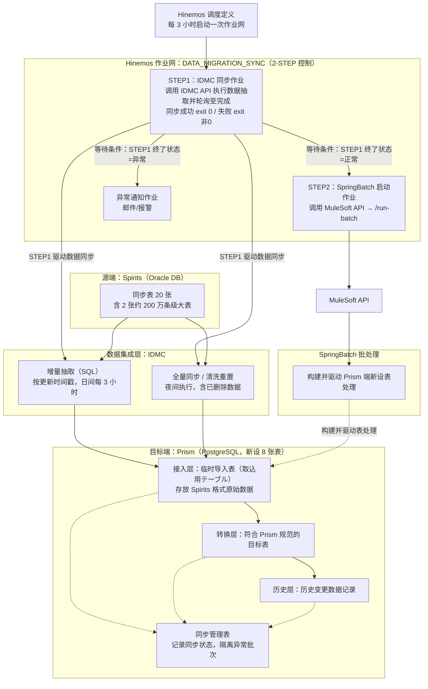

#### 一、 背景与架构设计

##### 架构图

* **同步策略**：
* **增量同步**：日间每 3 小时执行 1 次，以更新时间戳（更新日時）为基准拉取增量数据。

* **全量同步/重置**：夜间执行全量同步及清洗重置，包含已删除的数据处理。

* **增量抽取机制**：预先由 IDMC 执行 SQL 进行数据抽取，避免在 Spirits 端额外新建专用的增量抽取表或 JP1 任务。

* **2-STEP 执行控制**：IDMC 数据同步与 SpringBatch 处理拆分为 2 个 STEP，由 Hinemos 作业网顺序控制：
1. STEP1（IDMC 同步作业）：调用 IDMC API 执行数据抽取，并轮询至同步完成，成功返回正常终了（exit 0），失败返回异常终了（exit 非 0）。

2. STEP2（SpringBatch 启动作业）：设置等待条件为「STEP1 终了状态 = 正常」，仅在 IDMC 同步成功后，才调用 MuleSoft API 触发 SpringBatch；条件未满足时勾选「立即结束」，跳过本次 Batch 并由异常通知作业发出告警。

3. 失败不阻塞下一轮：STEP1 失败仅影响当次 STEP2，下一次 3 小时调度照常执行，与异常隔离设计保持一致。

4. 防止会话重叠：对作业网设置多重度控制（多重度 = 1），并启用开始/结束延迟监控，避免大表同步超过 3 小时窗口时产生并发会话。

* **Prism 端处理流程**：
1. 接入层：将 Spirits 格式的原始数据存入 Prism 的临时导入表（取込用テーブル）。

2. 转换层：基于导入表生成符合 Prism 规范的目标表。

3. 历史层：进一步生成历史变更数据记录。

* **异常隔离设计**：通过引入临时导入表和同步管理表，即使同步过程中途失败，也不会影响后续批处理或下一次增量同步的数据完整性。

#### 二、 利用要点与环境配置

* **源端数据库**：Oracle DB

* **目标端数据库**：PostgreSQL DB

* **数据集成/ETL 工具**：IDMC (Informatica Intelligent Data Management Cloud)

* **批处理与 API 触发**：使用 MuleSoft API 触发 SpringBatch 处理，并通过 SpringBatch 构建 Prism 端新设表。

* **调度管理**：通过 Hinemos 进行定时调度，每 3 小时启动一次作业网，按 2-STEP 顺序控制（STEP1 IDMC 同步 → STEP2 MuleSoft API 触发 SpringBatch），基于先行作业的终了状态/终了值实现条件分步执行。

* **数据规模**：
* 源端同步表共 20 个，其中包含 2 个 200 万条记录级别的巨型表。

* Prism 端新设表共 8 个。

#### 三、 当前技术课题与风险

* **异构数据库类型映射风险**：
* 虽然 IDMC 官方文档确认其支持按数据类型与精度进行数据加工，但仅凭文档无法完全确认从 Oracle 到 PostgreSQL 的自动类型转换范围与边界情况。

* **结论**：必须在实际测试环境中进行 POC（概念验证）测试。

#### 四、 针对性的下一步行动建议

1. **搭建验证环境（POC）**：优先针对 Oracle 到 PostgreSQL 的数据类型转换（尤其是大文本、高精度数值、时间戳时区等类型）编写测试脚本。
2. **大表性能压测**：对 200 万条数据规模的两张大表进行增量抽取与全量重置的性能测试，评估 3 小时窗口期内的系统吞吐量。
3. **失败重试与事务机制确认**：验证临时导入表在异常中断时的 Rollback 机制，确保断点续传或重试逻辑可靠。
4. **2-STEP 联动验证**：验证 STEP1 对 IDMC 异步同步状态的轮询判定（成功 exit 0 / 失败 exit 非 0），确认 STEP2 等待条件、条件未满足时的立即结束分支，以及作业网多重度控制的实际效果。

**【约束条件】**
严格按照逻辑分块输出，清晰明确，一律使用正向表述与简体中文呈现。