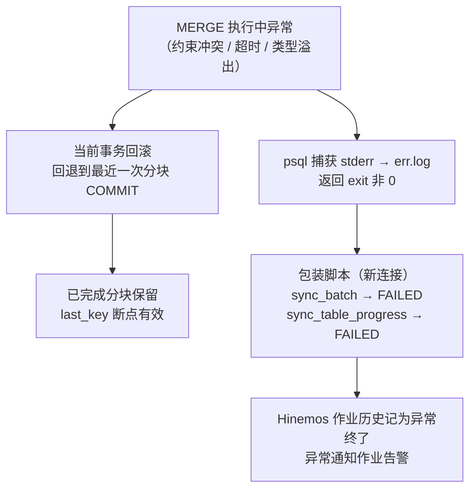

#### 一、 核心原则

* **异常记录必须写在独立连接、独立事务中完成**：过程内抛错时，当前事务从最近一次 COMMIT 处回滚，同一事务里写入的任何错误信息都会被一并抹除。
* **对应设计结构**：存储过程不带 EXCEPTION 块（保证可 COMMIT），失败记录由 psql 包装脚本在 CALL 失败后、通过**新的 psql 会话**补记——这正是纯 SQL 方案「过程无异常块 + 脚本层记录失败」结构的设计依据。


#### 二、 三层异常记录体系

| 层次 | 记录位置 | 记录内容 | 写入时机 |
| --- | --- | --- | --- |
| 批次层 | `sync_batch`（独立 psql 连接写入） | status=FAILED、错误摘要、结束时间、日志文件路径 | 包装脚本在 CALL 失败后写入 |
| 表级层 | `sync_table_progress`（独立连接写入） | 失败表定位（该批次中 status 仍为 RUNNING 的行 → 置 FAILED）、已处理行数、断点 `last_key` | 与批次层同一脚本写入 |
| 详细层 | PG 服务器日志 / stderr 捕获的 `err.log` | 完整错误信息：SQLSTATE、错误消息、语句位置、上下文 | PostgreSQL 自动记录；`psql 2> err.log` 捕获 |

* **配套联动**：Hinemos 作业历史记录 exit 非 0 并触发异常通知作业告警，形成「哪次批次失败 → 哪张表 → 断点在哪 → 错误详情在哪」的完整可追溯链。


#### 三、 调用脚本完整实现

```bash
#!/bin/bash
# run_sp_migration_sync.sh —— Hinemos STEP2 命令作业调用
LOG_DIR="/var/log/prism_sync"
TS=$(date +%Y%m%d_%H%M%S)
ERR_LOG="${LOG_DIR}/sync_err_${TS}.log"

# ① 执行存储过程，stderr 捕获到日志文件
psql -v ON_ERROR_STOP=1 -d prism \
     -c "CALL sp_migration_sync('${RUN_MODE}')" 2> "$ERR_LOG"
RC=$?

# ② 失败时：在【新连接】里补记异常（原事务已回滚，这里不受影响）
if [ $RC -ne 0 ]; then
    ERR_MSG=$(head -3 "$ERR_LOG" | tr "'" "''")
    psql -d prism <<SQL
UPDATE sync_batch
   SET status='FAILED', error_message='${ERR_MSG}',
       error_log='${ERR_LOG}', finished_at=NOW()
 WHERE status='RUNNING';

UPDATE sync_table_progress
   SET status='FAILED', error_message='${ERR_MSG}'
 WHERE batch_id = (SELECT MAX(batch_id) FROM sync_batch)
   AND status='RUNNING';
SQL
    exit $RC   # 透传非 0 → Hinemos 判定异常终了 → 触发异常通知作业
fi
exit 0
```

* **关键点**：第 ② 步的 `UPDATE` 使用新的 psql 会话（自动提交事务），即使第 ① 步的事务已整体回滚，FAILED 记录仍能可靠落库。


#### 四、 异常发生时的完整链路



1. **过程内**：异常无处理器直接向外抛出 → 当前事务回滚到最近检查点，已提交分块与 `last_key` 断点天然保留。
2. **psql 层**：`ON_ERROR_STOP=1` 使脚本立即中止，stderr 全量落入 `err.log`，返回码为非 0。
3. **脚本层**：新连接补记两张管理表的 FAILED 状态与错误摘要。
4. **调度层**：Hinemos 记录异常终了并触发告警；下一轮 3 小时调度照常执行，从断点续传。


#### 五、 可选增强

* **业务节点留痕**：过程内使用 `RAISE LOG 'table=% batch=%', v_tbl, v_batch` 写入服务器日志，不中止执行，便于定位耗时与失败位置。
* **监控视图**：建立 `v_sync_status` 视图聚合 `sync_batch` 与 `sync_table_progress`，运维一查即知最近批次状态与失败表。
* **告警自动化**：异常通知作业直接读取 `sync_batch.error_message` 生成告警正文，无需人工翻查日志。


#### 六、 与 SpringBatch 异常记录的对应

| SpringBatch 机制 | 纯 SQL 方案对应物 |
| --- | --- |
| job_execution / step_execution 状态与异常堆栈 | `sync_batch` / `sync_table_progress` 的 FAILED 状态与 error_message |
| 批处理日志（控制台/文件） | `err.log` + PG 服务器日志 |
| 失败后 restart（从头/断点） | `last_key` + `watermark` 断点续传 |
| 失败监听器与告警 | 包装脚本 exit 非 0 → Hinemos 异常通知作业 |

**【约束条件】**
严格按照逻辑分块输出，清晰明确，一律使用正向表述与简体中文呈现。
