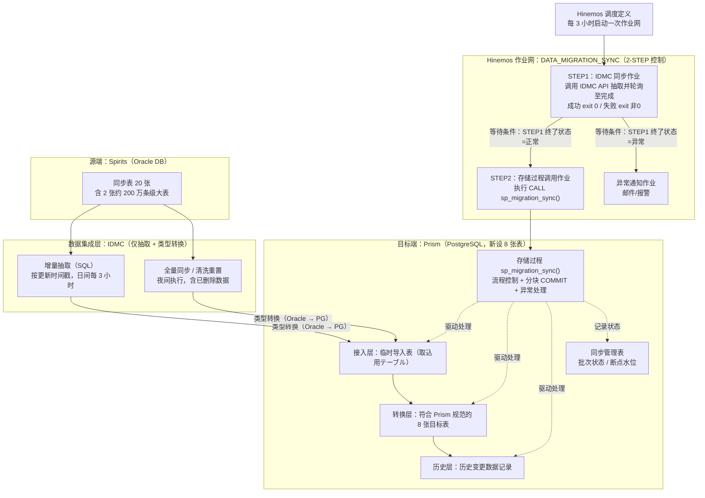
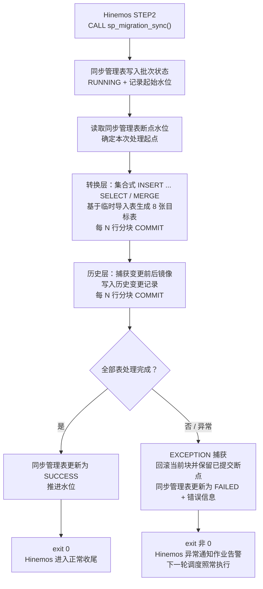
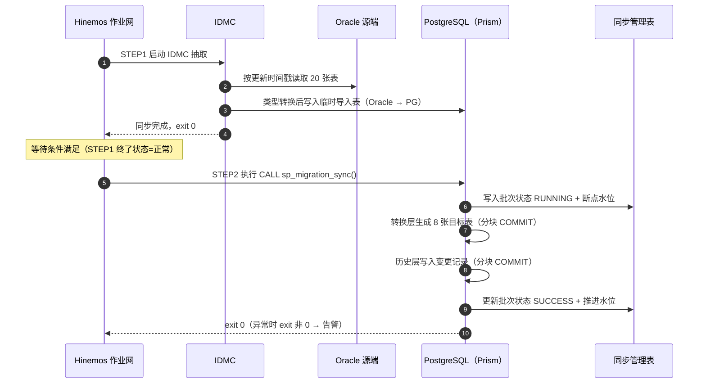

#### 一、 架构总览

* **方案定位**：STEP2 由「MuleSoft API → SpringBatch」调整为「调用 PostgreSQL 存储过程」，全部业务转换逻辑下沉到数据库内完成。
* **控制模型不变**：Hinemos 作业网 2-STEP 顺序控制保持原样，仅 STEP2 的执行形态变化。

#### 二、 STEP2 存储过程内部流程

#### 三、 执行时序

#### 四、 关键设计要点

* **2-STEP 控制保持不变**：STEP1 成功才执行 STEP2，Hinemos 等待条件与「条件未满足立即结束」机制照常适用。
* **跨库类型转换仅在 STEP1**：IDMC 完成 Oracle → PG 类型落地，存储过程输入输出全为 PG 类型，无跨库转换。
* **分块 COMMIT 防长事务**：200 万级大表按每 N 行提交，降低锁与 vacuum 压力（PG 11+ 过程内事务控制）。
* **断点续传**：同步管理表记录断点水位，异常中断后下次执行从水位处继续，已完成分块不重复处理。
* **异常隔离**：EXCEPTION 捕获失败批次并回滚当前块，同步管理表记录错误信息，失败仅影响当次，不阻塞下一轮调度。
* **成本零增量**：无 SpringBatch/MuleSoft 运行时开销，IDMC 计费仅取决于抽取时长与行数，不受本层影响。

**【约束条件】**
严格按照逻辑分块输出，清晰明确，一律使用正向表述与简体中文呈现。
