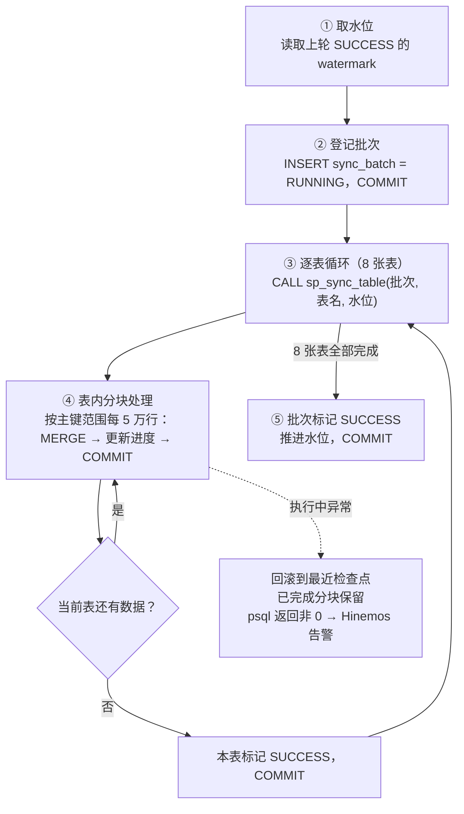

#### 一、 定位与调用方式

* **方案定位**：`sp_migration_sync()` 是纯 SQL 方案中 STEP2 的执行主体，一个 PL/pgSQL 存储过程，接替 SpringBatch 完成「从临时导入表生成 8 张目标表」的全部批处理逻辑。
* **控制模型不变**：STEP1（IDMC 同步）成功后由 Hinemos 触发本过程，2-STEP 等待条件机制零改动。

| 项目 | 内容 |
| --- | --- |
| 所在位置 | PostgreSQL（Prism 端） |
| 调用方 | Hinemos 作业网 STEP2 的命令作业 |
| 调用命令 | `psql -v ON_ERROR_STOP=1 -c "CALL sp_migration_sync('INCREMENTAL')"` |
| 返回语义 | 正常返回 → exit 0；报错中止 → psql exit 非 0 → Hinemos 判定异常终了并告警 |
| 运行模式 | 参数区分：`INCREMENTAL`（日间增量）/ `FULL`（夜间全量重置） |


#### 二、 依赖的同步管理表（状态与断点载体）

* 同步管理表是状态与断点的唯一载体，等价于 SpringBatch 的 JobRepository。

```sql
-- 批次级：一次调度一条记录（对应 SpringBatch 的 JobRepository）
CREATE TABLE sync_batch (
    batch_id      BIGSERIAL PRIMARY KEY,
    run_mode      VARCHAR(20) NOT NULL,    -- INCREMENTAL / FULL
    status        VARCHAR(20) NOT NULL,    -- RUNNING / SUCCESS / FAILED
    watermark     TIMESTAMP,               -- 读取起点（上轮成功水位）
    error_message TEXT,
    started_at    TIMESTAMP DEFAULT NOW(),
    finished_at   TIMESTAMP
);

-- 表级进度：每张表一条（对应 SpringBatch 的 Step 状态）
CREATE TABLE sync_table_progress (
    batch_id      BIGINT NOT NULL,
    table_name    VARCHAR(64) NOT NULL,
    status        VARCHAR(20) NOT NULL,    -- RUNNING / SUCCESS / FAILED
    rows_done     BIGINT DEFAULT 0,
    last_key      BIGINT,                  -- 分块断点（续传起点）
    error_message TEXT,
    PRIMARY KEY (batch_id, table_name)
);
```


#### 三、 内部执行流程



1. **取水位**：从 `sync_batch` 取最近一次 SUCCESS 的 `watermark`，作为增量读取起点。
2. **登记批次**：写入 RUNNING 并立即 COMMIT，保证后续即使失败，批次记录也不丢失。
3. **逐表循环**：对 8 张表依次调用内层过程 `sp_sync_table()`，每表结束后 COMMIT 一次（表级检查点）。
4. **表内分块**：内层过程按主键范围每 5 万行执行一条集合式 `MERGE`，更新进度行后 COMMIT（块级检查点），落实「分块 COMMIT 防长事务」。
5. **收尾推进**：全部成功则批次置 SUCCESS、水位推进；中途异常则回滚至最近检查点，已提交分块完整保留。


#### 四、 核心代码骨架

```sql
-- 外层：编排（无异常块，因此可以 COMMIT）
CREATE OR REPLACE PROCEDURE sp_migration_sync(p_mode VARCHAR := 'INCREMENTAL')
LANGUAGE plpgsql AS $$
DECLARE
    v_batch BIGINT;
    v_watermark TIMESTAMP;
    v_tbl TEXT;
    v_tables TEXT[] := ARRAY['表1','表2','表3','表4','表5','表6','表7','表8'];
BEGIN
    SELECT watermark INTO v_watermark
      FROM sync_batch WHERE status = 'SUCCESS'
     ORDER BY batch_id DESC LIMIT 1;

    INSERT INTO sync_batch(run_mode, status, watermark)
    VALUES (p_mode, 'RUNNING', v_watermark)
    RETURNING batch_id INTO v_batch;
    COMMIT;

    FOREACH v_tbl IN ARRAY v_tables LOOP
        CALL sp_sync_table(v_batch, v_tbl, v_watermark, p_mode);
        COMMIT;                              -- 表级检查点
    END LOOP;

    UPDATE sync_batch SET status = 'SUCCESS', finished_at = NOW()
     WHERE batch_id = v_batch;
    COMMIT;
END $$;

-- 内层：单表分块处理（无异常块，循环内 COMMIT）
CREATE OR REPLACE PROCEDURE sp_sync_table(
    p_batch BIGINT, p_table TEXT, p_watermark TIMESTAMP, p_mode VARCHAR)
LANGUAGE plpgsql AS $$
DECLARE
    v_last BIGINT := 0;  v_count BIGINT;  v_chunk CONSTANT INT := 50000;
BEGIN
    INSERT INTO sync_table_progress(batch_id, table_name, status, last_key)
    VALUES (p_batch, p_table, 'RUNNING', v_last);
    COMMIT;

    LOOP
        EXECUTE format(
            'WITH src AS (SELECT * FROM 取込テーブル
               WHERE 更新日時 >= $1 AND id > $2
               ORDER BY id LIMIT %s)
             MERGE INTO 目標テーブル t USING src s ON t.id = s.id
             WHEN MATCHED THEN UPDATE SET ...
             WHEN NOT MATCHED THEN INSERT ...', v_chunk)
        USING p_watermark, v_last;

        GET DIAGNOSTICS v_count = ROW_COUNT;
        EXIT WHEN v_count = 0;               -- 无剩余数据，本表完成

        v_last := v_last + v_chunk;
        UPDATE sync_table_progress
           SET rows_done = rows_done + v_count, last_key = v_last
         WHERE batch_id = p_batch AND table_name = p_table;
        COMMIT;                              -- 块级检查点（断点）
    END LOOP;

    UPDATE sync_table_progress SET status = 'SUCCESS'
     WHERE batch_id = p_batch AND table_name = p_table;
    COMMIT;
END $$;
```

* **失败时的 exit 非 0**：Hinemos 命令作业用脚本包裹，异常时补记 FAILED 再透传返回码。

```bash
psql -v ON_ERROR_STOP=1 -c "CALL sp_migration_sync('INCREMENTAL')" \
  || { psql -c "UPDATE sync_batch SET status='FAILED', finished_at=NOW() WHERE status='RUNNING'"; exit 1; }
```


#### 五、 与 SpringBatch 的概念对应

| SpringBatch 概念 | sp_migration_sync 对应物 |
| --- | --- |
| Job / JobRepository | `sync_batch` 批次表 |
| Step（导入/备份/同步） | 内层 `sp_sync_table()` 逐表阶段 |
| chunk 提交 | 循环内 `COMMIT`（每 5 万行） |
| 断点续传（restart） | `last_key` + `watermark` 水位 |
| Step 状态与计数 | `sync_table_progress`（rows_done 等） |
| JobLauncher 触发 | `CALL` 一条命令 |


#### 六、 关键技术注意点

1. **`CALL` 必须是顶层调用**：过程内 `COMMIT` 仅在顶层 `CALL`（或无中间命令的嵌套 `CALL`）中允许。
2. **有 EXCEPTION 块的范围内不能 COMMIT**：采用「外层编排 + 内层执行、两者都不带异常块」的结构，失败处理交给 psql 脚本层，断点靠「回滚到最近检查点」天然实现。
3. **幂等性**：`MERGE`（PG 15+）或 `ON CONFLICT DO UPDATE` 保证同一分块重复执行结果一致，断点续传与重跑均安全。

**【约束条件】**
严格按照逻辑分块输出，清晰明确，一律使用正向表述与简体中文呈现。
