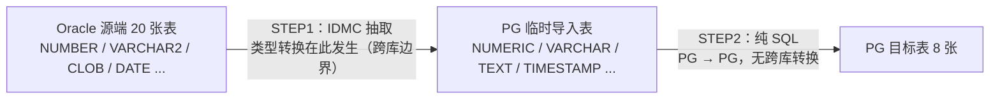

#### 一、 结论

* **技术可行性**：仅使用 SQL（含 PL/pgSQL 存储过程）实现 Prism 端 8 张新设表的生成，技术上完全可行。
* **能力支撑**：PostgreSQL 提供与 Oracle PL/SQL 对等的过程化编程语言 PL/pgSQL，完整支持条件分支、循环、游标、异常处理与事务控制等逻辑编程功能。
* **推荐形态**：采用「声明式 SQL + PL/pgSQL 存储过程」的组合方案，集合式 SQL 承担集合转换，存储过程承担流程控制、分块提交与异常管理。

#### 二、 PostgreSQL 与 Oracle PL/SQL 能力对照

| Oracle 能力 | PostgreSQL 对应能力 | 说明 |
| --- | --- | --- |
| PL/SQL 匿名块 | `DO $$ ... $$` 块 | DECLARE / BEGIN / EXCEPTION / END 结构一致 |
| 存储过程 | `CREATE PROCEDURE` + `CALL`（PG 11+） | 过程内可执行 COMMIT / ROLLBACK，与 Oracle 存储过程对齐 |
| 存储函数 | `CREATE FUNCTION` | 单事务内执行，不控制事务 |
| 触发器 | `CREATE TRIGGER`（BEFORE/AFTER，行级/语句级） | 语法不同，能力等价 |
| 包（PACKAGE） | schema 分组 | 无包级变量，用 schema 组织函数与过程 |
| 条件分支 / 循环 / 游标 | `IF` / `CASE`、`LOOP` / `WHILE` / `FOR`、游标 | 完整支持 |
| 异常处理 | `EXCEPTION WHEN ... THEN` | 异常名有差异（如 `DUP_VAL_ON_INDEX` → `UNIQUE_VIOLATION`） |
| DBMS_OUTPUT | `RAISE NOTICE` | 消息级别 NOTICE / INFO / WARNING / DEBUG |
| MERGE 文 | `MERGE`（PG 15+）、`INSERT ... ON CONFLICT`（PG 9.5+） | 增量合并 upsert 的关键能力 |
| 其他过程语言 | PL/Python、PL/Perl、PL/JavaScript | 支持更复杂逻辑编程 |

#### 三、 三层流程的 SQL 实现评估

* **接入层（原始数据入临时表）**：纯 SQL 即可实现，`INSERT INTO ... SELECT` 完成；该层原由 IDMC 承担，不受本方案影响。
* **转换层（生成 8 张目标表）**：纯 SQL 可行，集合式的 `INSERT ... SELECT` / `MERGE` / `ON CONFLICT DO UPDATE` 一次完成多表转换；对 200 万级大表，集合操作性能通常优于逐行批处理。
* **历史层（变更记录）**：建议使用「SQL + 触发器」或存储过程实现，两种方式均在数据库内完成：
  1. 目标表配置 BEFORE UPDATE / INSERT 触发器，自动写入历史表。
  2. 存储过程中先记录旧值镜像，再执行更新，同步写入历史表。

#### 四、 两种「只用 SQL」形态的区分

* **纯声明式 SQL（无过程逻辑）**：
  * 转换层可行，集合转换表达力充足。
  * 历史层与失败重试处理能力有限，复杂分支与断点控制不足。
* **SQL + PL/pgSQL 存储过程**：
  * 完全可行，等价于将批处理逻辑下沉到数据库。
  * 过程内分块 COMMIT（PG 11+）实现断点续传。
  * 异常捕获与回滚，并写入同步管理表记录执行状态。

#### 五、 纯 SQL 方案与 SpringBatch 方案对比

| 对比维度 | 纯 SQL（含 PL/pgSQL 存储过程） | SpringBatch（Java 批处理） |
| --- | --- | --- |
| 数据转换性能 | 集合操作在库内执行，无网络与序列化开销，200 万级大表表现优 | 逐行/chunk 处理，需读取到应用层，存在序列化开销 |
| 逻辑表达能力 | 分支、循环、游标、异常处理齐备，复杂业务逻辑需过程化编程 | Java 语言完整表达，复杂逻辑与算法实现更灵活 |
| 流程编排 | 存储过程内顺序执行，依赖同步管理表自建断点 | 原生 Step / Job 编排，chunk、skip、retry 开箱即用 |
| 失败重试与断点续传 | 需自建：分块 COMMIT + 同步管理表记录进度 | 原生支持：Step 级重启、chunk 级重试 |
| 执行状态与监控 | 需自建状态表，监控依赖 SQL 查询与日志 | Job / Step 执行元数据表原生提供，生态监控完善 |
| 事务与锁控制 | 过程内分块 COMMIT 精细控制，长事务风险需设计规避 | chunk 粒度提交，事务边界清晰 |
| 部署与变更 | DDL/DML 脚本入库执行，变更即发布，无需应用发版 | 需构建、发布应用版本，发布流程较重 |
| 运维与团队技能 | 依赖 DBA / SQL 技能，数据库内逻辑排障门槛较高 | 依赖 Java 团队，应用层排障与本地调试更便利 |
| 架构复杂度 | 组件少：Hinemos + 数据库存储过程即可闭环 | 组件多：Hinemos + MuleSoft + SpringBatch 三层链路 |
| 与现有 2-STEP 模型契合 | STEP2 简化为一次 `CALL`，等待条件机制不变 | STEP2 经 MuleSoft API 触发，链路完整保留 |
| 可测试性 | SQL 脚本级测试，单元测试框架较弱 | JUnit 集成测试成熟，可 mock 数据源 |
| 复用性与扩展性 | 逻辑沉淀在数据库，跨系统复用方便 | 逻辑在应用层，多作业共享组件化能力强 |

* **选型倾向**：
  1. 若核心诉求为大表转换性能、简化链路与快速落地，选择纯 SQL 方案。
  2. 若核心诉求为复杂流程编排、成熟重试机制与团队 Java 技能沉淀，选择 SpringBatch 方案。
  3. 两方案与 2-STEP 控制模型均兼容，Hinemos 等待条件机制不受影响。

#### 六、 Oracle 与 PostgreSQL 类型转换边界

* **核心事实**：源端 20 张同步表为 Oracle 类型，同步落库后为 PostgreSQL 类型，**类型转换必需且不可省略**；该转换集中在 STEP1（IDMC 抽取）完成，是全链路唯一的跨库转换点。

* **STEP1（IDMC）承担**：通过 Oracle 连接器读取源数据，在写入 PostgreSQL 临时导入表时完成类型落地（JDBC 隐式映射 + Mapping 显式转换规则），20 张表全部覆盖。
* **STEP2（纯 SQL）承担**：输入与输出均为 PG 类型，仅做库内类型变换，不涉及跨库转换。
* **POC 关联**：转换规则的边界情况正是《DATA_MIGRATION.md》第三章 POC 验证项（大文本、高精度数值、时间戳时区）的验证对象。

#### 七、 Oracle → PostgreSQL 全类型转换一览表

##### 1. 数值类型

| Oracle 类型 | PostgreSQL 类型 | 转换说明 |
| --- | --- | --- |
| `NUMBER(p, s)` | `NUMERIC(p, s)` | 精度、标度逐一对应；`p ≤ 9` 可用 `INTEGER`、`p ≤ 18` 可用 `BIGINT` 优化性能 |
| `NUMBER`（无精度声明） | `NUMERIC` | 建议在 PG 侧显式定义精度，避免无约束 |
| `INTEGER` / `INT` | `INTEGER` | 直接对应 |
| `SMALLINT` | `SMALLINT` | 直接对应 |
| `DECIMAL` / `DEC` | `NUMERIC` | 直接对应 |
| `FLOAT(n)`（二进制精度） | `NUMERIC` 或 `DOUBLE PRECISION` | Oracle `FLOAT` 实为 `NUMBER(p)`，按精度需求选择映射 |
| `BINARY_FLOAT` | `REAL` | 单精度浮点，二进制语义 |
| `BINARY_DOUBLE` | `DOUBLE PRECISION` | 双精度浮点，二进制语义 |
| `BINARY_INTEGER` / `PLS_INTEGER` | `INTEGER` | 仅 PL/SQL 内部类型，表列一般不出现 |

##### 2. 字符类型

| Oracle 类型 | PostgreSQL 类型 | 转换说明 |
| --- | --- | --- |
| `CHAR(n)` | `CHAR(n)` | Oracle 默认按 BYTE 计长，需确认 n 为字节还是字符后对齐 |
| `NCHAR(n)` | `CHAR(n)` | 国家字符集，落库统一 UTF-8 |
| `VARCHAR2(n)` | `VARCHAR(n)` | 同样需确认 BYTE/CHAR 语义；超大文本（>10485760 字节）改用 `CLOB` → `TEXT` |
| `NVARCHAR2(n)` | `VARCHAR(n)` | 国家字符集 |
| `LONG` | `TEXT` | Oracle 已废弃类型，建议源端先改造为 `CLOB` |
| `ROWID` / `UROWID` | `VARCHAR(40)` | 一般不同步；如需保留按普通字符串处理 |

##### 3. 日期时间类型

| Oracle 类型 | PostgreSQL 类型 | 转换说明 |
| --- | --- | --- |
| `DATE` | `TIMESTAMP` | ⭐ Oracle `DATE` 含时分秒，**禁止**映射为 PG `DATE`，否则丢失时间部分 |
| `TIMESTAMP(n)` | `TIMESTAMP(n)` | `n` 取 0~9，PG 最高支持 6（微秒） |
| `TIMESTAMP(n) WITH TIME ZONE` | `TIMESTAMPTZ(n)` | 时区语义需在 POC 中确认 |
| `TIMESTAMP WITH LOCAL TIME ZONE` | `TIMESTAMPTZ` | 按会话时区显示，落库为 UTC |
| `INTERVAL YEAR(n) TO MONTH` | `INTERVAL` | 直接对应 |
| `INTERVAL DAY(n) TO SECOND` | `INTERVAL` | 直接对应 |

##### 4. 二进制与 LOB 类型

| Oracle 类型 | PostgreSQL 类型 | 转换说明 |
| --- | --- | --- |
| `CLOB` | `TEXT` | 直接对应（大文本 POC 项） |
| `NCLOB` | `TEXT` | 国家字符集大文本 |
| `BLOB` | `BYTEA` | 直接对应 |
| `RAW(n)` | `BYTEA` | `n ≤ 2000` 字节 |
| `LONG RAW` | `BYTEA` | Oracle 已废弃类型，建议源端改造 |
| `BFILE` | 无对应类型 | 外部文件指针，需应用层另行处理，一般不纳入同步范围 |

##### 5. 特殊与复杂类型

| Oracle 类型 | PostgreSQL 类型 | 转换说明 |
| --- | --- | --- |
| `SYS.XMLTYPE` / `XMLType` | `XML` 或 `TEXT` | PG 原生支持 XML 类型 |
| 对象类型 / `VARRAY` / 嵌套表 | `JSONB` 或子表 | 需拆解为关系列或序列化为 JSON |
| `SDO_GEOMETRY`（空间类型） | `geometry`（PostGIS 扩展） | 需安装 PostGIS 扩展，否则转 `TEXT` |
| `JSON`（Oracle 21c+） | `JSONB` | PG 14+ 原生支持 |
| `REF` / 游标类型 / `ANYDATA` | 无对应类型 | 非表列可同步类型，不纳入同步范围 |

##### 6. 跨库语义注意事项

1. **空串与 NULL**：Oracle 中 `''` 等同 NULL，PG 中 `''` 与 NULL 为不同值，落库前需明确保留策略。
2. **字符计长语义**：Oracle `VARCHAR2(n)` 默认 BYTE 语义，PG `VARCHAR(n)` 为字符语义，需统一后映射。
3. **标识符大小写**：Oracle 默认大写、PG 默认小写，建表与查询引用需统一命名策略。
4. **NLS 会话依赖**：Oracle 日期格式受 `NLS_DATE_FORMAT` 影响，IDMC Mapping 中应使用显式 `CAST` / `TO_CHAR` 而非依赖默认格式。
5. **时区与会话参数**：`TIMESTAMP WITH TIME ZONE` 与会话时区设置需在 POC 中固定验证。

#### 八、 IDMC 使用成本分析（成本优先方针）

##### 1. IDMC 计费模型（IPU 德量制）

| 计费维度 | 计量项 | 参考费率 | 与类型转换的关系 |
| --- | --- | --- | --- |
| 默认（CDI 处理） | Compute Units，按作业运行时长 | 0.16 IPU/小时（前 2000 小时），之后 0.025 | 类型转换仅增加极微小运行时间，增量几乎可忽略 |
| SQL ELT 优化开启时 | Rows Processed，按目标写入行数 | 0.048 IPU/百万行（前 1 亿行） | 与转换复杂度完全无关，0 行写入 = 0 IPU |

* **IPU 消费公式**：消费 IPU = 计量用量 × 费率；计量项中不存在「转换规则数」「字段映射数」维度。
* **结论**：类型转换是抽取作业的内置环节，**不产生独立费用**；IDMC 成本只由运行时长、处理行数与频次决定。

##### 2. 成本优先下的职责划分

| 层 | 归属 | 成本影响 |
| --- | --- | --- |
| Oracle → PG 类型落地（跨库边界，STEP1） | IDMC | 必需且几乎零增量成本 |
| 8 张表业务转换逻辑（STEP2） | PostgreSQL 纯 SQL | 零 IDMC 消耗，纯 SQL 方案的核心成本优势 |
| 若将 8 张表转换也放入 IDMC | IDMC | 映射复杂度上升 → 运行时长上升 → IPU 上升，与成本优先相悖 |

* **成本最优定位**：现有架构「IDMC 只做抽取与类型落地 + PG 端完成全部业务转换」正是成本优先方针下的最优解。

##### 3. 成本优化杠杆

1. **保持增量抽取**：按更新时间戳拉取增量，压低每次运行时长与行数。
2. **转换逻辑留在 PG**：IDMC 映射越简单，运行时间越短，IPU 消耗越低。
3. **监控与阈值**：IPU 控制台支持 25 / 50 / 75 / 95 / 100% 消耗告警；月度 IPU 不结转，需按月盯紧用量。
4. **评估 SQL ELT Optimization**：按写入行数计费，配合差分抽取可大幅降低 IPU；需先验证 Oracle → PostgreSQL 跨库场景是否支持下推，并确认下推后函数行为差异（如 CONCAT 对 NULL 的处理）。

##### 4. 成本量级参考

* 日间每 3 小时增量（8 次/天）+ 夜间全量重置的模式下，仅 Data Integration 项估算约 **12~25 IPU/月** 量级（单次增量按 20 分钟、4 核 Compute Unit 最小值测算）。
* 以上为量级参考，实际数值需以 POC 期间 Metering 控制台的实测数据为准。

#### 九、 实施前提与风险对应

1. **PG 版本确认**：`MERGE` 需要 PG 15 及以上；若为 PG 14，使用 `INSERT ... ON CONFLICT DO UPDATE` 替代，功能等价。
2. **架构联动变更**：STEP2 的触发形态从「MuleSoft API → SpringBatch」调整为「调用 `CALL sp_migration_sync()` 存储过程」；2-STEP 控制模型保持不变，Hinemos 等待条件机制照常适用，MuleSoft 是否继续参与触发需重新定义。
3. **能力取舍与承接**：放弃 SpringBatch 的 chunk / 重试 / Step 状态元数据，由同步管理表 + 存储过程自建等价机制（现有同步管理表可直接承接）。
4. **长事务风险控制**：200 万行大表避免单事务跑完，使用 PG 11+ 过程内分块 COMMIT，降低锁与 vacuum 压力。

#### 十、 结论性建议

* 采用「声明式 SQL + PL/pgSQL 存储过程」方案实现 Prism 端 8 张表生成，技术风险可控。
* 类型转换边界明确：20 张表的 Oracle → PG 类型转换由 IDMC 在 STEP1 完成（对照表见第七章），STEP2 纯 SQL 仅做 PG 库内转换，且不产生额外 IDMC 费用。
* POC 阶段优先验证 4 项：PG 版本对应语法、Oracle → PG 类型转换边界情况（大文本、高精度数值、时间戳时区、空串与 NULL）、200 万级大表分块提交性能、异常中断后的断点续传。
* 确认采用后，同步更新《DATA_MIGRATION.md》架构图中 STEP2 的形态。

**【约束条件】**
严格按照逻辑分块输出，清晰明确，一律使用正向表述与简体中文呈现。
