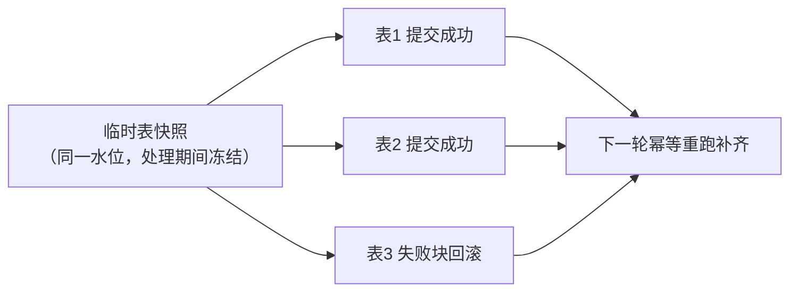

#### 一、 核心结论

* **不是必须**：8 张新设表不必放入单一大事务处理；整合性可由「同源快照 + 依赖顺序 + 幂等 MERGE」组合保障。
* **不必一错全滚**：按推荐设计，任一表失败仅回滚该表的当前块，已完成的表保留，下一轮幂等重跑补齐；全量回滚只在显式选择「单一大事务」或「影子表方案」时出现（影子表方案回滚的只是影子表，正式表零污染）。
* **决策前提**：确认两件事——① 8 张表之间是否存在外键/跨表联查；② 读取方能否容忍 3 小时周期内的短暂中间态。

#### 二、 三种整合性保障方案对比

| 方案 | 原子性 | 失败影响范围 | 代价 | 适用条件 |
| --- | --- | --- | --- | --- |
| ① 单一大事务（8 表一事务） | 全有或全无 | 任一表失败 → 8 表全部回滚 | 200 万行 × 8 表长事务：锁持有久、xmin 残留导致表膨胀、WAL/checkpoint 压力大；与分块 COMMIT 断点续传设计直接冲突 | 数据量小、表间强耦合 |
| ② 依赖顺序 + 同源快照（推荐） | 表级/块级提交 | 只回滚失败表的当前块，其余表保留 | 需按拓扑顺序处理、下轮幂等重跑 | 表间关系可控、可容忍处理窗口 |
| ③ 影子表 + 原子切换（RENAME） | 逻辑全原子 | 失败时影子表整体丢弃，正式表零污染 | 需要双倍存储、切换瞬间短暂锁 | 强一致读 + 大数据量兼得 |

#### 三、 当前设计为何不必单事务

* **数据同源**：STEP1（IDMC）先把 20 张源表完整落入临时导入表后，STEP2 才开始执行（2-STEP 控制 + 多重度=1 保证处理期间临时表不被并发刷新），8 张目标表全部派生自同一个临时表快照。
* **内容天然一致**：即使逐表提交，各表在「数据版本」上保持一致（同一水位、同一时刻的源数据）。
* **单事务的真实作用**：解决的是「读取方在处理窗口内看到半新半旧」的可见性问题，而非数据本身的一致性。

#### 四、 分情况决策

* **情况 A：8 张表相互独立（无外键、无跨表联查）**
  无需任何特殊处理，保持「逐表 + 分块提交」，失败只补跑失败表，为最省成本的路径。
* **情况 B：8 张表有外键/业务依赖，读取方容忍 3 小时周期内的短暂窗口**
  1. STEP2 按依赖拓扑顺序处理（被引用的父表先处理，子表后处理），逐表提交即可满足外键约束。
  2. 失败时只回滚失败表所在块，已完成表保留，下一轮从断点幂等重跑补齐（`MERGE` 幂等保证不重复不遗漏）。
* **情况 C：读取方要求「8 张表要么全旧、要么全新」，绝不可见中间态**
  采用方案③影子表 + 原子切换（同仓库《README-Spring-Batch-ShadowSync.md》的既有设计：建 `_staging` → 校验 → `RENAME` 原子切换），切换为毫秒级短事务，兼得全原子性与低锁风险。
* **情况 D：显式选择单一大事务（方案①）**
  仅当 8 张表总量可控（总耗时评估为数分钟内）且放弃断点续传时才成立；中途失败则 8 表全部重来，与成本优先方针相悖，不推荐。

#### 五、 两个核心问题的明确回答

1. **必须放一个事务吗？**
   不必须。整合性由「同源快照 + 依赖顺序 + 幂等 MERGE」保障；只有要求处理窗口内跨表原子可见时，才需要方案①或方案③。
2. **任一表失败要全部回滚吗？**
   按推荐设计不需要——只回滚失败表的当前块，已完成的表保留，下一轮幂等补齐；仅在选择单事务或影子表方案时才是全有或全无（影子表方案回滚的仅为影子表，正式表不受影响）。

#### 六、 待确认事项

1. 8 张表之间是否存在外键或跨表联查关系（决定走情况 A 还是情况 B/C）。
2. 读取方能否容忍 3 小时周期内的短暂中间态（决定是否需要影子表原子切换）。
3. 确认结论后，同步更新《PURE_SQL_ARCHITECTURE.md》的事务设计章节。

**【约束条件】**
严格按照逻辑分块输出，清晰明确，一律使用正向表述与简体中文呈现。
