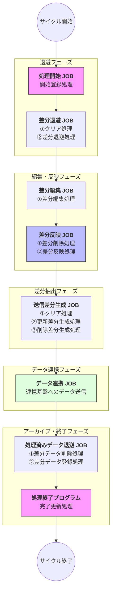
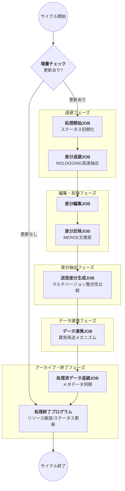
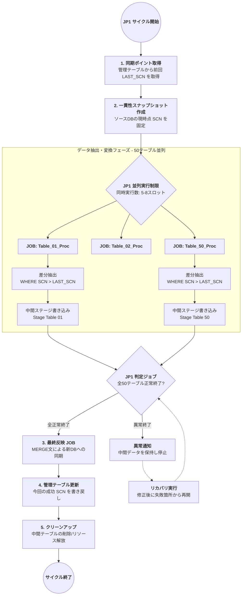

# JP1 JOB一覧およびシステムパラメータの情報

### 1. 通常データ処理 (Normal Data Processing) JOB一覧

通常モードは、「全量同期・差分抽出・連携」のフローで動作します。

| JOB名              | 属する群（A/B/C/Dシーケンス） | 内部PL-SQL処理タスク                                                  | 機能概要                                           |
|:------------------|:-------------------|:---------------------------------------------------------------|:-----------------------------------------------|
| **退避 JOB**        | 退避JOB群             | ①クリア処理 (TRUNCATE) ②退避処理 (SELECT→INSERT)                     | 元テーブルのデータを退避テーブルへコピーします。NOLOGGING設定等で高速化を図ります。 |
| **編集 JOB**        | 機能別編集JOB群          | ①編集処理 (INSERT)                                                 | 退避テーブルを基に、Global統制テーブルの要件に従ってデータを登録します。        |
| **差分生成 JOB**      | 機能別編集JOB群          | ①クリア処理 (TRUNCATE) ②更新差分生成処理 ③削除差分生成処理                    | 今回のGlobal統制データと前回処理分を比較し、更新・削除の差分を抽出します。       |
| **データ連携 JOB**     | データ連携JOB群          | ①データ連携処理                                                       | 生成された差分データを、連携基盤（Informatica/Snowflake）へ送信します。 |
| **処理済みデータ退避 JOB** | 処理済みデータ退避JOB群      | ①テーブル物理削除 (DROP) ②テーブルリネーム処理 (RENAME) ③テーブル作成処理 (CREATE) | 送信完了後のデータを次回の比較用に「前回処理分」として保存します。              |

---

### 2. 大規模データ処理 (Large-scale Data Processing) JOB一覧

大量のデータを扱う際、更新箇所のみを抽出・反映するモードです。

| JOB名              | フェーズ  | 内部PL-SQL処理タスク                               | 機能概要                                      |
|:------------------|:------|:--------------------------------------------|:------------------------------------------|
| **処理開始 JOB**      | 準備    | ①開始登録処理                                     | 統制処理日時テーブルにレコードを挿入し、処理を開始します。             |
| **差分退避 JOB**      | 退避    | ①クリア処理 (TRUNCATE) ②差分退避処理                | 前回処理以降に更新されたデータのみを抽出し、退避テーブルに反映します。       |
| **差分編集 JOB**      | 編集    | ①差分編集処理 (INSERT)                            | 退避された差分データを基に、Global統制形式の差分レコードを作成します。    |
| **差分反映 JOB**      | 反映    | ①差分削除処理 ②差分反映処理                          | 差分データをGlobal統制(ALL)全量テーブルに直接反映（削除後登録）します。 |
| **送信差分生成 JOB**    | 差分抽出  | ①クリア処理 (TRUNCATE) ②更新差分生成処理 ③削除差分生成処理 | 全量テーブル・前回分・今回の差分を比較し、最終的な送信ファイルを生成します。    |
| **処理済みデータ退避 JOB** | アーカイブ | ①差分データ削除処理 ②差分データ登録処理                    | 今回の差分データを「前回処理分」テーブルに同期反映します。             |
| **処理終了 JOB**      | 終了    | ①完了更新処理                                     | 処理日時テーブルの完了フラグを更新し、サイクルを終了します。            |

---

### 3. システム実行環境パラメータまとめ

| 項目            | 内容詳細                                                           |
|:--------------|:---------------------------------------------------------------|
| **実行周期**      | 統括JOBは **3時間周期** で実行されます。                                      |
| **並列アーキテクチャ** | **A、B、C、D** の4つの並列シーケンスで構成されます。                                |
| **主な技術スタック**  | JP1（スケジューラ）、PL-SQL（ロジック）、Oracle（DB）、Informatica/Snowflake（連携）。 |
| **データ連携の原則**  | **差分データのみ**を連携し、すべてのマスタが揃ってから一括送信します。                          |
| **データ保持**     | 退避・編集データのバックアップは **1世代のみ** 保持します。                              |

ソースに基づき、大規模データ処理（Large-scale Data Processing）のジョブフローを日本語で作成しました。

### 各ステップの処理概要：

1. **処理開始 JOB**：統制処理日時テーブルにレコードを挿入し、今回の処理サイクルを開始します。
2. **差分退避 JOB**：前回処理日時以降に更新されたデータのみを抽出し、退避テーブルに反映します。
3. **差分編集・反映 JOB**：差分データに対して編集を行い、Global統制(ALL)テーブルへ直接反映（削除および登録）します。
4. **送信差分生成 JOB**：Global統制(ALL)テーブル、前回処理分、および今回の更新差分を比較し、送信用の最終差分データを作成します。
5. **データ連携 JOB**：生成された差分データを連携基盤（Informatica/Snowflake）へ送信します。
6. **処理済みデータ退避 JOB**：今回の差分データを用いて、前回処理分テーブルを同期更新します。
7. **処理終了プログラム**：完了日時を更新し、一連の処理を終了します。

---

# ジョブフロー図と解説

最適化された大規模データ処理（Large-scale Data Processing）のジョブフローです。

### ジョブフローの要点解説

3時間周期という高頻度な実行に耐えるため、大規模データ処理モードでは以下の工夫がなされています。

1. **処理開始 JOB**:
   管理テーブルに今回の実行IDと開始時刻を記録します。これにより、多重実行の防止やリカバリ時の起点特定を行います。
2. **差分退避 JOB**:
   全量データではなく、前回の処理時刻（LST: Last Success Time）以降に更新されたレコードのみを抽出します。これにより、DBのI/O負荷を大幅に軽減します。
3. **差分反映 JOB**:
   Global統制テーブル（ALLテーブル）に対して、削除(Delete)と挿入(Insert)を行い、常に最新の状態を維持します。
4. **送信差分生成 JOB**:
   単なる「追加」だけでなく、「削除されたデータ」も連携対象に含めるため、前回分との比較ロジックを走らせます。
5. **データ連携 JOB**:
   Informatica等の外部ツールを呼び出し、Snowflake等のターゲット環境へデータを送出します。
6. **処理済みデータ退避 JOB**:
   次回の「差分比較」の基準となるよう、今回のデータを「前回処理分」テーブルにアーカイブして処理を締めくくります。

---

针对您“备份、提取、全成功后同步、位点管理”的增量迁移需求，我为您构建了日文版的 **JP1 ジョブネット（Jobnet）論理構成**。

这套架构采用了日本大型系统常用的**“三段構え（三段式控制）”**，确保了百万级数据在 50 个表并行处理时的可靠性与一致性。

---

### 技術ポイントの解説

#### 1. 一貫性スナップショット（Consistency Snapshot）
同期開始時に `CURRENT_SCN` を取得します。
* **目的**: 50個のテーブルの抽出タイミングがずれても、全テーブルが「同期開始時点」のデータで整合性が取れるようにします（データドリフトの防止）。

#### 2. 中間ステージングエリア（Staging Area）
* **デカップリング（疎結合）**: 旧DBから新DBへ直接ロードせず、一度中間テーブルに書き込みます。これにより、同期処理（MERGE）が失敗しても、旧DBへの再アクセス（高負荷な抽出）なしでリトライが可能です。
* **ビジネスロジックの適用**: ユーザー様が仰る「業務要件に応じた抽出」はこのフェーズで行います。

#### 3. MERGE文による「重複更新の防止」
`Sync_Reflect` ジョブでは、以下のロジックを推奨します。
* **Update if exists, Insert if not**: すでに新DBに存在するレコードは更新し、存在しないものは新規作成します。
* **メリット**: べき等性（Idempotency）が確保されるため、同じ差分データを誤って2回流してもデータが二重になることはありません。

#### 4. JP1 運用上の設計
* **実行リソース制限**: 百万件×50テーブルの処理は Undo/Redo ログを大量に消費するため、JP1 の「実行リソース」機能で同時実行数を絞り、DBへの負荷をコントロールします。
* **チェックポイントの原子性**: `Update_Pos`（管理テーブル更新）を必ず一番最後に配置します。これ以前のジョブが失敗した場合、管理テーブルは更新されないため、次回のサイクルで自動的に「前回の続き」から再送（断点続行）されます。

---

### 用語集（Glossary）
* **差分抽出（Incremental Extraction）**: 変更分のみを抜き出すこと。
* **反映（Reflection/Apply）**: 抽出したデータをターゲットに書き込むこと。
* **後続リカバリ（Recovery Job）**: 異常終了時に自動でクリーンアップや再試行を行うジョブ。
* **SCN (System Change Number)**: Oracle内部の論理的な時刻。

このフローにより、旧DBが稼働し続けていても、定期的に最新の変更分だけを新DBへ確実に取り込むことが可能になります。
