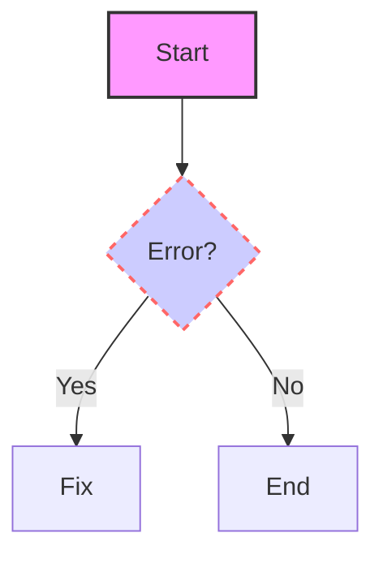
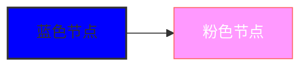
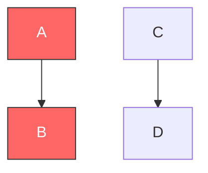
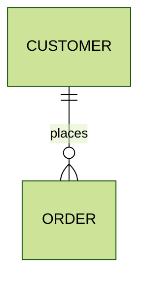
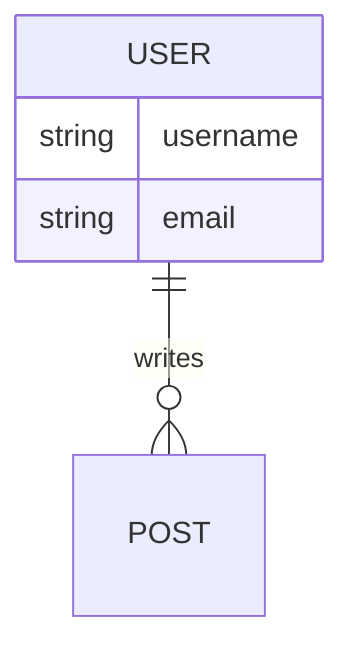
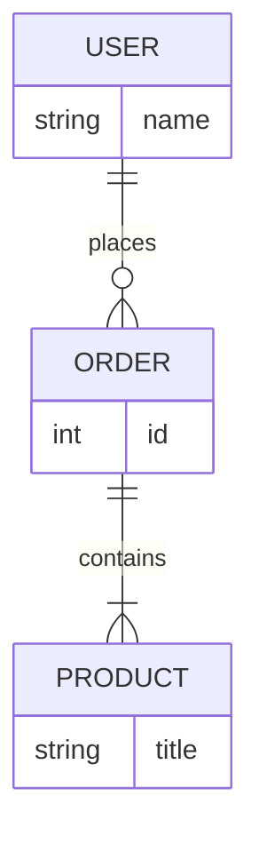
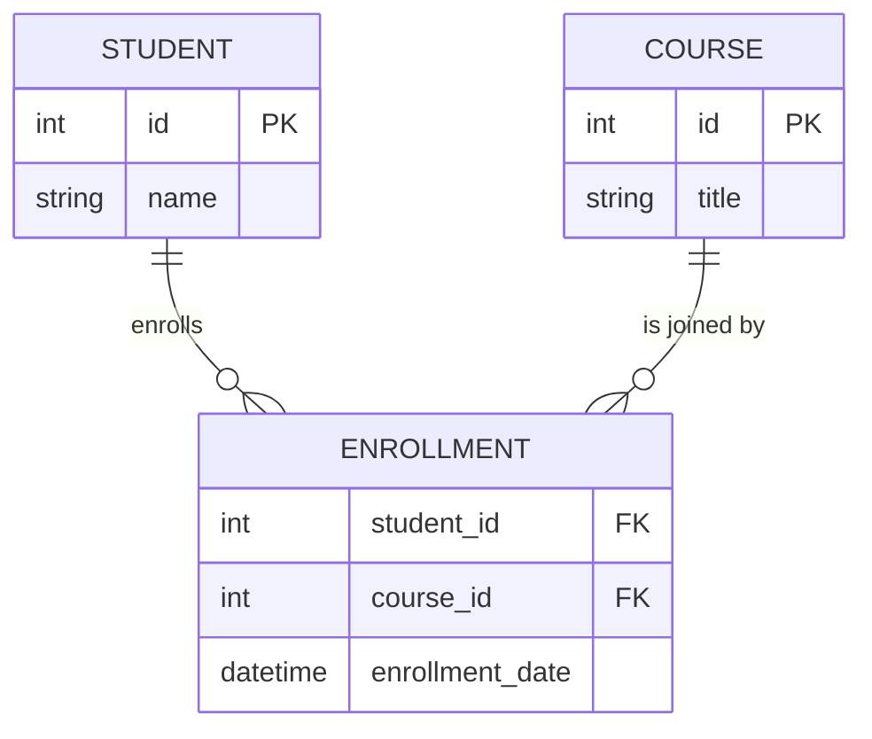
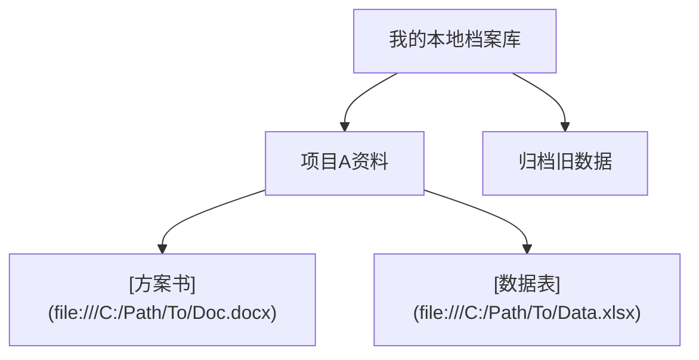
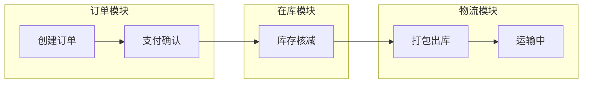
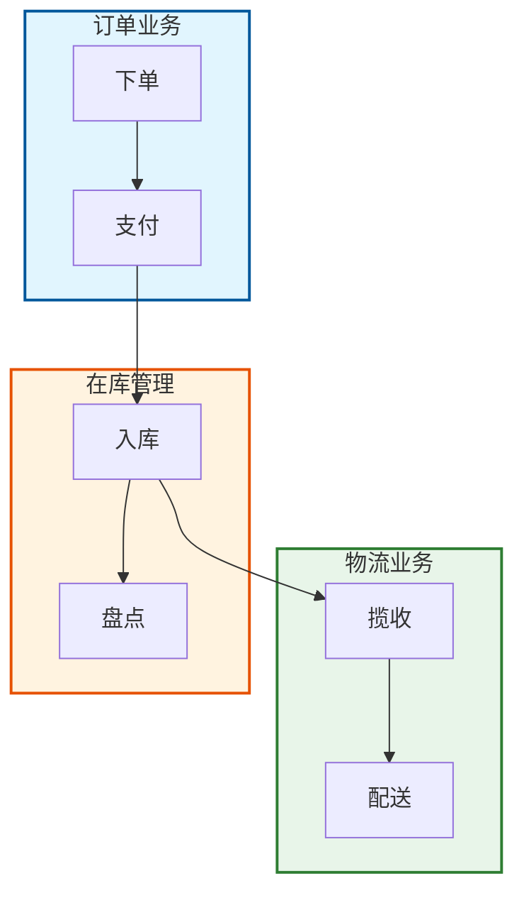

markdown 语法
=====

大标题
=====

中标题
-----

# 一级标题

## 二级标题

### 三级标题

#### 四级标题

##### 五级标题

###### 六级标题

这是一段普通的文本，
直接回车不能换行， 
要使用\ 
 注意第三行的\ 前加了反斜杠 \ 。目的就是像其他语言那样实现转义，也就是 <  的转义。

插入单行引用
> 一盏灯，一片昏黄；一简书，一杯淡茶。守着那一份淡定，品读属于自己的寂寞。保持淡定，才能欣赏到最美丽的风景！保持淡定，人生从此不再寂寞。

*斜体字*
**粗体字**
***加粗斜体字***

List

- George Washington

* John Adams

+ Thomas Jefferson

1. James Madison
2. James Monroe
3. John Quincy Adams

Nested Lists

1. First list item
    - First nested list item
        - Second nested list item

Task lists

- [x] No.739
- [ ] https://github.com/octo-org/octo-repo/issues/740
- [ ] Add delight to the experience when all tasks are complete :tada:
- [ ] \(Optional) Open a followup issue

表格

| 表格  | 第一列 | 第二列 |
|-----|:---:|:---:|
| 第一行 | 第一列 | 第二列 |

分割线
***

---

***图片***

---

***网络图片***

---

***本地图片***

---

    <strong>警告：</strong> 这里是警告信息。

# mermaid 例子

1. 基本语法

2. 精确控制：单个节点样式

3. 批量控制：类定义 (classDef)

4. 进阶自定义：修改主题变量

1. 全局主题切换
   使用 config 配置项快速更改预设配色方案：

2. 深度自定义 (themeVariables)
   如果你需要精确控制实体框、线条或文本的颜色，必须通过 themeVariables 修改。这通常配合 base 主题使用：

实现方案：利用 CSS ID 选择器
Mermaid 渲染 ER 图时，会为每个实体生成一个以 entity-实体名 为规则的 ID。你可以利用这个特性在图表顶部注入样式：

1. 基础分类：使用 Subgraph
   你可以将相关的节点放在同一个 subgraph 块中：

2. 进阶分类：为分类上色
   为了视觉上更清晰，你可以用 style 给整个子图（分类框）设置不同的背景色：

这是使用中心化的 SSO (Single Sign-On) 服务的方案的 Mermaid 示意图：

**图示说明：**

* **参与者 (Participants):** 用户、系统 A (你的 React/Next.js 应用)、系统 B (例如 PHP 博客)、SSO Server (中心化的认证服务)。
* **登录流程:**
    * 用户尝试访问系统 A 的受保护资源。
    * 系统 A 检测到用户未认证，将用户重定向到 SSO Server。
    * SSO Server 显示登录页面。
    * 用户在 SSO Server 提交凭据并成功登录。SSO Server 设置一个全局会话 Cookie。
    * SSO Server 将用户重定向回系统 A，并携带授权凭据（例如 OAuth 2.0 的授权码）。
    * 系统 A 使用授权凭据向 SSO Server 请求 Access Token 和 ID Token。
    * SSO Server 返回令牌。
    * 系统 A 使用 Access Token 授予用户访问权限。
* **访问其他系统 (System B):**
    * 用户尝试访问系统 B 的受保护资源。
    * 系统 B 检测到用户未认证，将用户重定向到 SSO Server。
    * SSO Server 检测到用户已经拥有有效的 SSO 会话 Cookie，直接将用户重定向回系统 B 并携带授权凭据，无需再次登录。
    * 系统 B 同样向 SSO Server 请求并获取令牌，然后授予用户访问权限。
* **登出流程:**
    * 用户在系统 A 触发登出。
    * 系统 A 通知 SSO Server 用户登出。
    * SSO Server 清除用户的全局会话 Cookie。
    * （可选）SSO Server 可以通知其他已登录的应用进行登出（例如通过 back-channel logout）。
    * 系统 A 完成本地登出。

# TODO

- [x] Write a report [3]
- [ ] Read related information [3]
- [ ] Submit code review [3]

# Reference

[Basic writing and formatting syntax](https://docs.github.com/cn/get-started/writing-on-github/getting-started-with-writing-and-formatting-on-github/basic-writing-and-formatting-syntax)

[gitconfig の基本を理解する](https://qiita.com/shionit/items/fb4a1a30538f8d335b35)

[github悬停显示文字](https://github.com "悬停显示文字")
