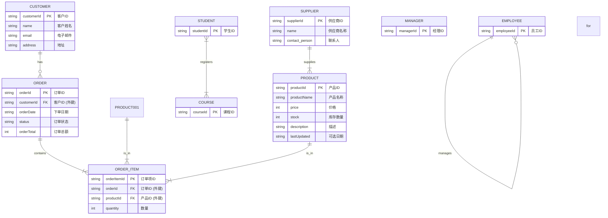

Mermaid
=====

Mermaid 是一个用于绘制图表的开源工具。它使用 Markdown 语法来描述图表，并生成静态的 HTML 页面。

# Examples

### Entity-Relationship Diagram (ERD) ER图（实体关系图）

```mermaid
erDiagram
%%--------------------------------------------------
%%                  实体和属性定义
%%--------------------------------------------------
CUSTOMER {
string customerId PK "客户ID"
string name "客户姓名"
string email "电子邮件"
string address "地址"
}

    ORDER {
        string orderId PK "订单ID"
        string customerId FK "客户ID (外键)"
        string orderDate "下单日期"
        string status "订单状态"
        int orderTotal "订单总额"
    }

    PRODUCT {
        string productId PK "产品ID"
        string productName "产品名称"
        int price "价格"
        int stock "库存数量"
        string description "描述"
        string lastUpdated "可选日期"
    }

    SUPPLIER {
        string supplierId PK "供应商ID"
        string name "供应商名称"
        string contact_person "联系人"
    }

    ORDER_ITEM {
        string orderItemId PK "订单项ID"
        string orderId FK "订单ID (外键)"
        string productId FK "产品ID (外键)"
        int quantity "数量"
    }
    
    EMPLOYEE {
        string employeeId PK "员工ID"
    }
    
    MANAGER {
        string managerId PK "经理ID"
    }

    STUDENT {
        string studentId PK "学生ID"
    }
    
    COURSE {
        string courseId PK "课程ID"
    }

    %%--------------------------------------------------
    %%                  关系定义
    %%--------------------------------------------------
    
    CUSTOMER ||--o{ ORDER : has

    ORDER ||--|{ ORDER_ITEM : contains

    PRODUCT001 ||--|{ ORDER_ITEM : is_in
    
    PRODUCT ||--|{ ORDER_ITEM : is_in
    
    SUPPLIER ||--|{ PRODUCT : supplies

    STUDENT }|--|{ COURSE : registers for

    EMPLOYEE ||--o{ EMPLOYEE : manages
```