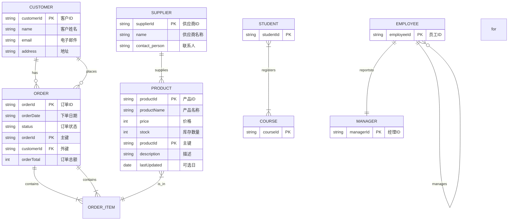

Mermaid
=====

Mermaid 是一个用于绘制图表的开源工具。它使用 Markdown 语法来描述图表，并生成静态的 HTML 页面。

# Examples

### Entity-Relationship Diagram (ERD) ER图（实体关系图）

这是 Mermaid ER 图所有样式的完整示例，包含了实体、属性、关系以及它们的各种细节。

要渲染这段代码，你需要一个支持 **Mermaid ERD** 语法的编辑器，比如 **Typora**、**Obsidian** 或在线的 **Mermaid Live Editor**。

### 样式解读

* **`erDiagram`**: 这是声明一个 ER 图的 Mermaid 关键字。
* **`实体名称 { ... }`**: 用大括号定义一个实体，并在其中列出它的属性。
* **`属性类型 属性名称 键 描述`**: 定义一个属性。
    * **`PK`**: **主键 (Primary Key)**，用于唯一标识实体。
    * **`FK`**: **外键 (Foreign Key)**，引用其他实体的主键。
    * **`?`**: 可选属性。如果省略，则默认为必需属性。
    * **`"描述"`**: 属性的中文描述或注释。
* **`实体1 基数1--基数2 实体2 : 关系`**: 定义实体间的关系。
    * **`||`**: **一对一**，代表“且只有一”。
    * **`|{`**: **一对多**，代表“一个或多个”。
    * **`o{`**: **零对多**，代表“零个或多个”。
    * **`|o`**: **零对一**，代表“零个或一”。
    * **`}`**: **多对多**，代表“一个或多个”。（注意，Mermaid 使用 `}|--|{` 来表示多对多）
* **`--`**: 关系线，连接两个实体。
* **`: 关系名称`**: 关系线的末尾可以加上冒号和关系名称，以提供更多信息。

# Reference

- [Mermaid 官方文档](https://mermaid.js.org/syntax/flowchart.html)
- [Mermaid Chart是一个在线工具，让用户通过简单的文本代码和AI快速创建各种专业图表，如流程图和序列图。](https://www.mermaidchart.com/app/projects/8fdff60c-2a2c-470a-ab5d-536d0fb0b6cf/diagrams/08e94010-88f6-4bd1-88c7-5b2752d979af/version/v0.1/edit)
- [Mermaid Live Editor(Github) 本地编辑，预览和共享Mermaid图表。](https://github.com/mermaid-js/mermaid-live-editor?tab=readme-ov-file)