Mermaid
=====

Mermaid 是一个用于绘制图表的开源工具。它使用 Markdown 语法来描述图表，并生成静态的 HTML 页面。

# Examples

### Entity-Relationship Diagram (ERD) ER图（实体关系图）

这是 Mermaid ER 图所有样式的完整示例，包含了实体、属性、关系以及它们的各种细节。

要渲染这段代码，你需要一个支持 **Mermaid ERD** 语法的编辑器，比如 **Typora**、**Obsidian** 或在线的 **Mermaid Live Editor**。

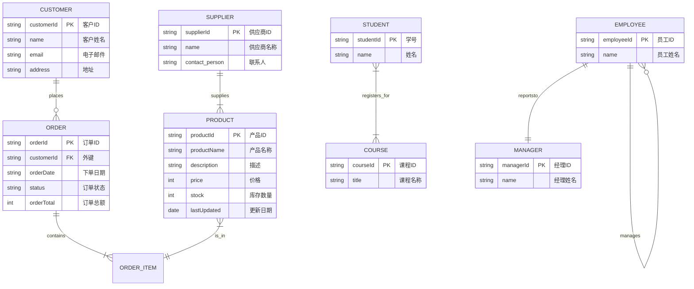
```mermaid
erDiagram
    %%--------------------------------------------------
    %% 实体定义 (Entity Definition)
    %%--------------------------------------------------
    CUSTOMER ||--o{ ORDER : places
    CUSTOMER {
        string customerId PK "客户ID"
        string name "客户姓名"
        string email "电子邮件"
        string address "地址"
    }

    ORDER ||--|{ ORDER_ITEM : contains
    ORDER {
        string orderId PK "订单ID"
        string customerId FK "外键"
        string orderDate "下单日期"
        string status "订单状态"
        int orderTotal "订单总额"
    }

    PRODUCT }|--|| ORDER_ITEM : is_in
    PRODUCT {
        string productId PK "产品ID"
        string productName "产品名称"
        string description "描述"
        int price "价格"
        int stock "库存数量"
        date lastUpdated "更新日期"
    }

    SUPPLIER ||--|{ PRODUCT : supplies
    SUPPLIER {
        string supplierId PK "供应商ID"
        string name "供应商名称"
        string contact_person "联系人"
    }

    EMPLOYEE ||--|| MANAGER : reportsto
    EMPLOYEE {
        string employeeId PK "员工ID"
        string name "员工姓名"
    }
    MANAGER {
        string managerId PK "经理ID"
        string name "经理姓名"
    }

    STUDENT }|--|{ COURSE : registers_for
    STUDENT {
        string studentId PK "学号"
        string name "姓名"
    }
    COURSE {
        string courseId PK "课程ID"
        string title "课程名称"
    }

    %% 循环关系 (Recursive Relationship): 员工可以管理其他员工
    EMPLOYEE ||--o{ EMPLOYEE : manages
```

### 样式解读

* **`erDiagram`**: 这是声明一个 ER 图的 Mermaid 关键字。
* **`实体名称 { ... }`**: 用大括号定义一个实体，并在其中列出它的属性。
* **`属性类型 属性名称 键 描述`**: 定义一个属性。
    * **`PK`**: **主键 (Primary Key)**，用于唯一标识实体。
    * **`FK`**: **外键 (Foreign Key)**，引用其他实体的主键。
    * **`?`**: 可选属性。如果省略，则默认为必需属性。
    * **`"描述"`**: 属性的中文描述或注释。
* **`实体1 基数1--基数2 实体2 : 关系`**: 定义实体间的关系。
    * **`||`**: **一对一**，代表“且只有一”。
    * **`|{`**: **一对多**，代表“一个或多个”。
    * **`o{`**: **零对多**，代表“零个或多个”。
    * **`|o`**: **零对一**，代表“零个或一”。
    * **`}`**: **多对多**，代表“一个或多个”。（注意，Mermaid 使用 `}|--|{` 来表示多对多）
* **`--`**: 关系线，连接两个实体。
* **`: 关系名称`**: 关系线的末尾可以加上冒号和关系名称，以提供更多信息。

---

这是一个包含 **Mermaid 目前主要图表类型** 的 Markdown 示例文档。你可以直接复制并粘贴到支持 Mermaid 渲染的 Markdown 编辑器（如 Obsidian、Typora、GitHub、Notion 等）中查看效果。


# Mermaid 全图表类型代码示例库

## 1. 基础流程图 (Flowchart)

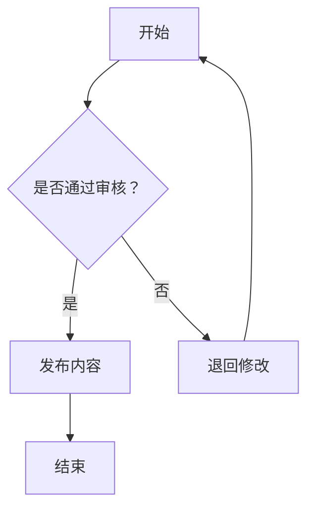
```mermaid
flowchart TD
    A[开始] --> B{是否通过审核？}
    B -- 是 --> C[发布内容]
    B -- 否 --> D[退回修改]
    D --> A
    C --> E[结束]

```

## 2. 时序图 / 序列图 (Sequence Diagram)

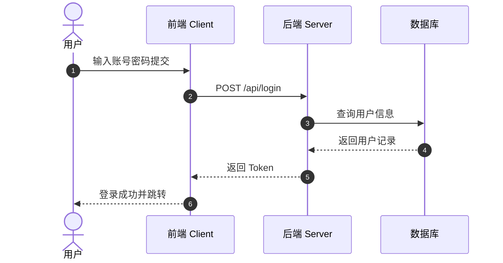
```mermaid
sequenceDiagram
    autonumber
    actor User as 用户
    participant Client as 前端 Client
    participant Server as 后端 Server
    participant DB as 数据库

    User->>Client: 输入账号密码提交
    Client->>Server: POST /api/login
    Server->>DB: 查询用户信息
    DB-->>Server: 返回用户记录
    Server-->>Client: 返回 Token
    Client-->>User: 登录成功并跳转

```

## 3. 类图 (Class Diagram)

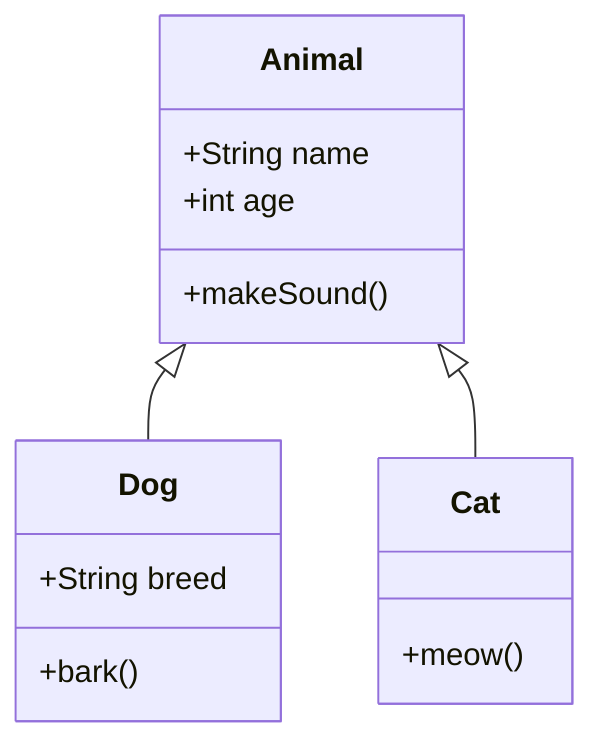
```mermaid
classDiagram
    class Animal {
        +String name
        +int age
        +makeSound()
    }
    class Dog {
        +String breed
        +bark()
    }
    class Cat {
        +meow()
    }
    Animal <|-- Dog
    Animal <|-- Cat

```

## 4. 状态图 (State Diagram)

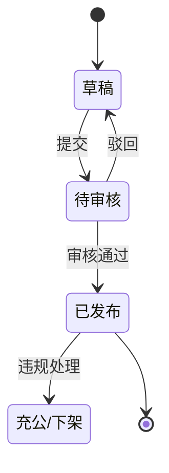
```mermaid
stateDiagram-v2
    [*] --> 草稿
    草稿 --> 待审核 : 提交
    待审核 --> 已发布 : 审核通过
    待审核 --> 草稿 : 驳回
    已发布 --> 充公/下架 : 违规处理
    已发布 --> [*]

```

## 5. 实体关系图 (Entity Relationship Diagram / ER)

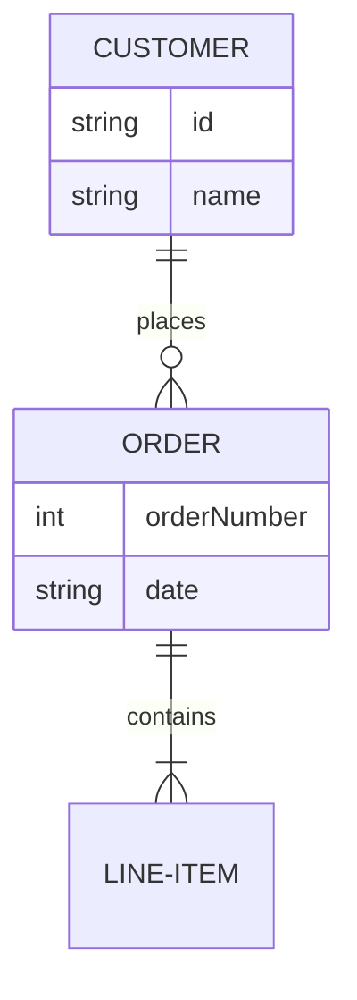
```mermaid
erDiagram
    CUSTOMER ||--o{ ORDER : places
    ORDER ||--|{ LINE-ITEM : contains
    CUSTOMER {
        string id
        string name
    }
    ORDER {
        int orderNumber
        string date
    }

```

## 6. 甘特图 (Gantt Chart)

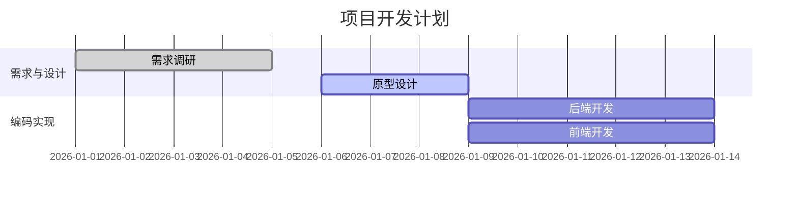
```mermaid
gantt
    dateFormat  YYYY-MM-DD
    title 项目开发计划
    section 需求与设计
    需求调研          :done,    des1, 2026-01-01, 2026-01-05
    原型设计          :active,  des2, 2026-01-06, 3d
    section 编码实现
    后端开发          :         dev1, after des2, 5d
    前端开发          :         dev2, after des2, 5d

```

## 7. 饼图 (Pie Chart)

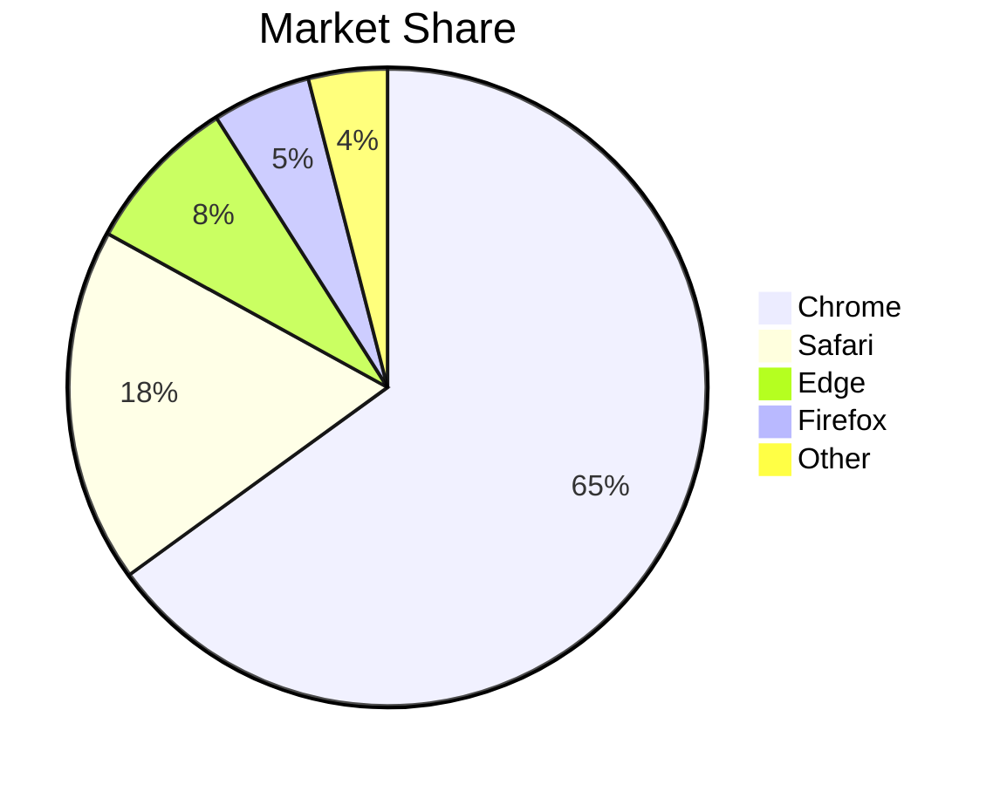
```mermaid
pie title Market Share
    "Chrome" : 65
    "Safari" : 18
    "Edge" : 8
    "Firefox" : 5
    "Other" : 4
```

## 8. Git 分支图 (Gitgraph)

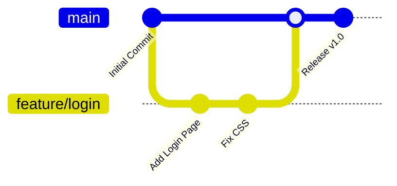
```mermaid
gitGraph
    commit id: "Initial Commit"
    branch feature/login
    checkout feature/login
    commit id: "Add Login Page"
    commit id: "Fix CSS"
    checkout main
    merge feature/login
    commit id: "Release v1.0"

```

## 9. 思维导图 (Mindmap)

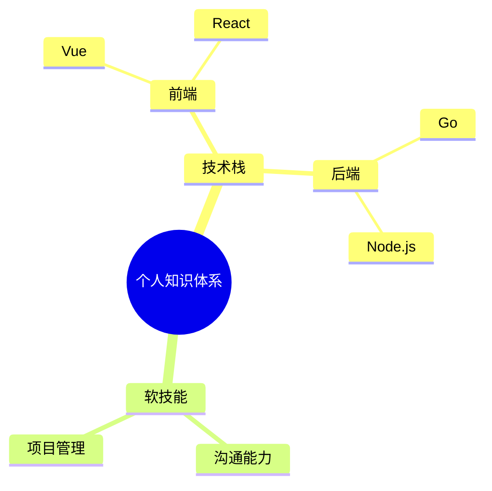
```mermaid
mindmap
  root((个人知识体系))
    技术栈
      前端
        Vue
        React
      后端
        Go
        Node.js
    软技能
      沟通能力
      项目管理

```

## 10. 用户旅程图 (User Journey)

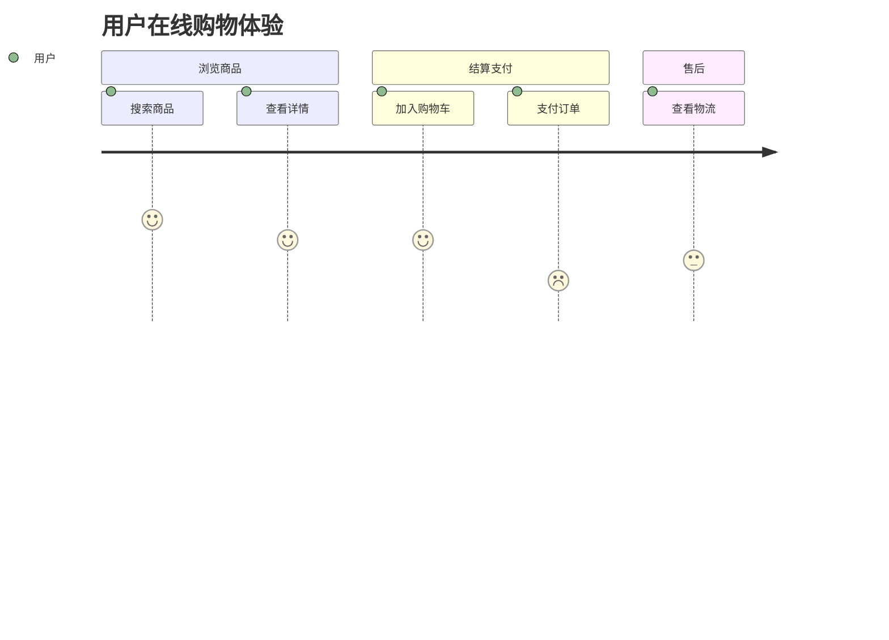
```mermaid
journey
    title 用户在线购物体验
    section 浏览商品
      搜索商品: 5: 用户
      查看详情: 4: 用户
    section 结算支付
      加入购物车: 4: 用户
      支付订单: 2: 用户
    section 售后
      查看物流: 3: 用户

```

## 11. 时间线 (Timeline)

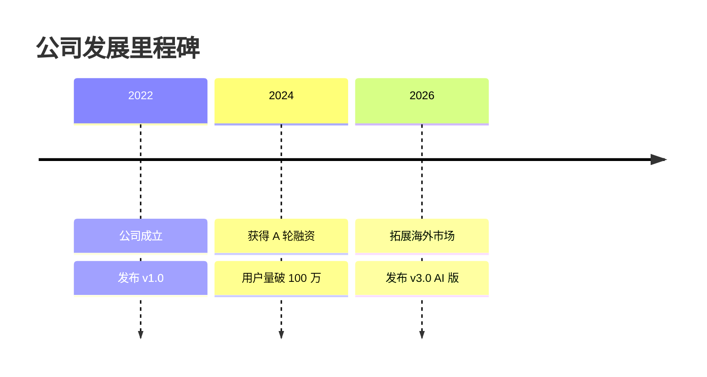
```mermaid
timeline
    title 公司发展里程碑
    2022 : 公司成立 : 发布 v1.0
    2024 : 获得 A 轮融资 : 用户量破 100 万
    2026 : 拓展海外市场 : 发布 v3.0 AI 版

```

## 12. 象限图 (Quadrant Chart)

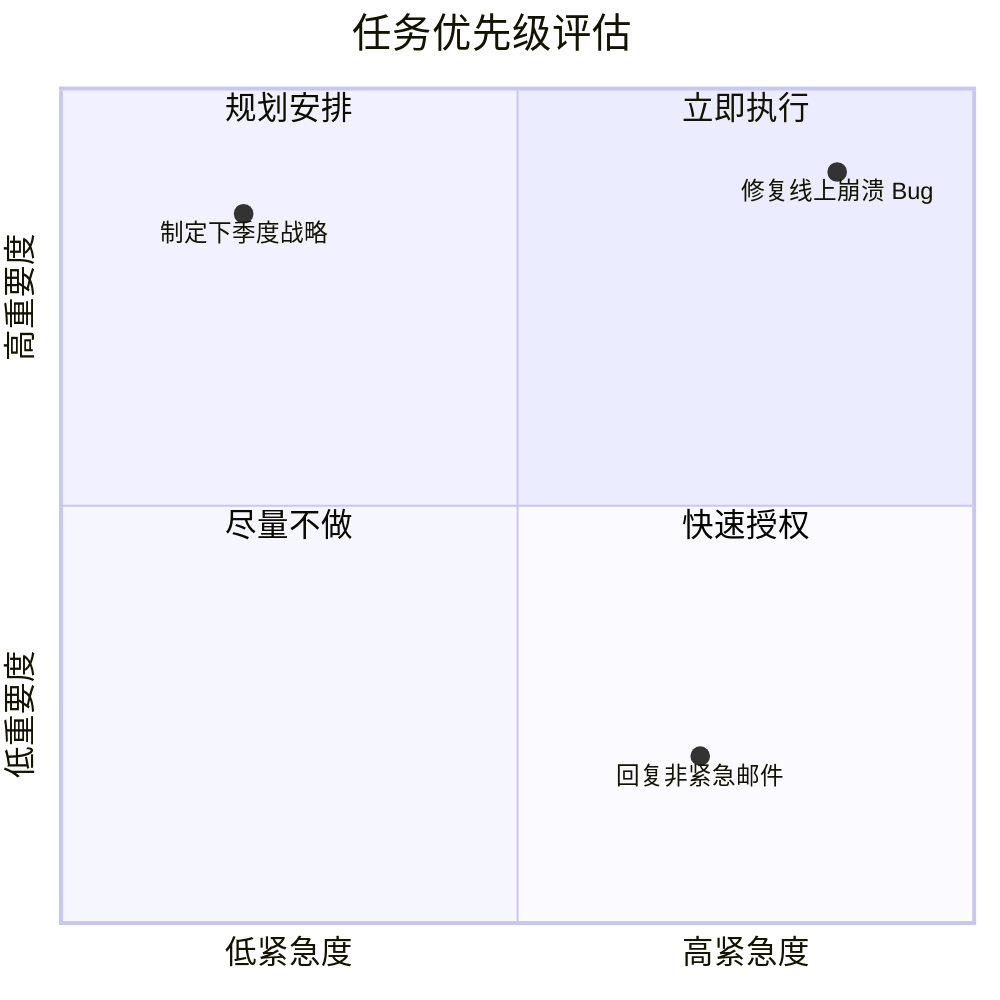
```mermaid
quadrantChart
    title 任务优先级评估
    x-axis 低紧急度 --> 高紧急度
    y-axis 低重要度 --> 高重要度
    quadrant-1 立即执行
    quadrant-2 规划安排
    quadrant-3 尽量不做
    quadrant-4 快速授权
    "修复线上崩溃 Bug": [0.85, 0.90]
    "制定下季度战略": [0.20, 0.85]
    "回复非紧急邮件": [0.70, 0.20]

```

## 13. C4 架构图 (C4 Context)

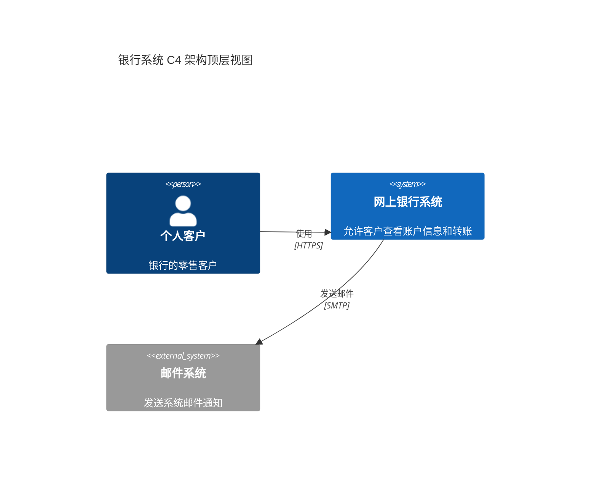
```mermaid
C4Context
    title 银行系统 C4 架构顶层视图
    Person(customer, "个人客户", "银行的零售客户")
    System(banking_system, "网上银行系统", "允许客户查看账户信息和转账")
    System_Ext(mail_system, "邮件系统", "发送系统邮件通知")

    Rel(customer, banking_system, "使用", "HTTPS")
    Rel(banking_system, mail_system, "发送邮件", "SMTP")

```

## 14. 桑基图 (Sankey Diagram)

桑基图（Sankey Diagram）是一种用于可视化数据流动和转换的图表，箭头宽度表示流量大小。适用于展示用户行为路径、能源流向、预算分配等场景。

### 基础语法

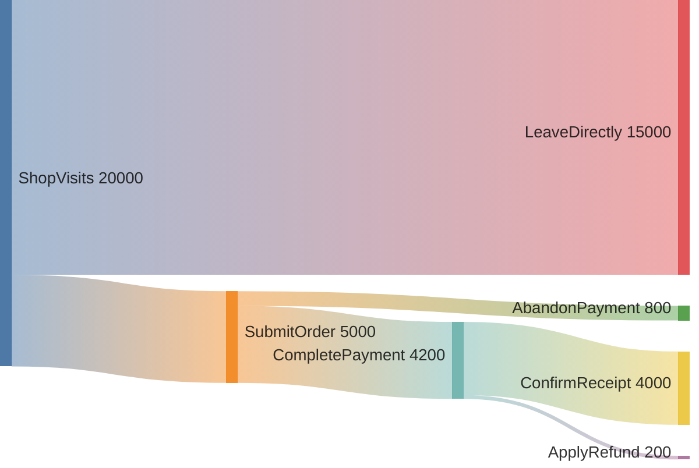
```mermaid
sankey-beta
ShopVisits,SubmitOrder,5000
ShopVisits,LeaveDirectly,15000
SubmitOrder,CompletePayment,4200
SubmitOrder,AbandonPayment,800
CompletePayment,ConfirmReceipt,4000
CompletePayment,ApplyRefund,200
```

### 语法说明

* **`sankey-beta`**: 声明桑基图的关键字（实验性功能，v10.3.0+）。
* **CSV 格式**: 每行包含三个逗号分隔的值：`源节点,目标节点,流量值`。
    * **源节点 (source)**: 流量的起始节点名称。
    * **目标节点 (target)**: 流量的结束节点名称。
    * **流量值 (value)**: 数值，决定箭头宽度（必须为正数）。
* **空行**: 可以在数据行之间添加空行以提高可读性。
* **特殊字符处理**:
    * 包含逗号的文本需要用双引号包裹：`Pumped heat,"Heating and cooling, homes",193.0`
    * 包含双引号的文本需要转义：`Pumped heat,"Heating and cooling, ""homes""",193.0`
* **注释**: 使用 `%%` 添加注释。

### 配置选项

通过 `<script>` 标签配置图表样式：

```html
<script>
  const config = {
    startOnLoad: true,
    securityLevel: 'loose',
    sankey: {
      width: 800,           // 图表宽度（像素）
      height: 400,          // 图表高度（像素）
      linkColor: 'source',  // 连接线颜色模式
      nodeAlignment: 'left', // 节点对齐方式
    },
  };
  mermaid.initialize(config);
</script>
```

#### 连接线颜色 (`linkColor`)

* **`source`**: 颜色与源节点一致（默认）。
* **`target`**: 颜色与目标节点一致。
* **`gradient`**: 颜色从源节点渐变到目标节点。
* **十六进制颜色码**: 指定固定颜色，如 `#a1a1a1`。

#### 节点对齐方式 (`nodeAlignment`)

* **`justify`**: 两端对齐。
* **`center`**: 居中对齐。
* **`left`**: 左对齐（默认）。
* **`right`**: 右对齐。

### 进阶示例：多层级数据流

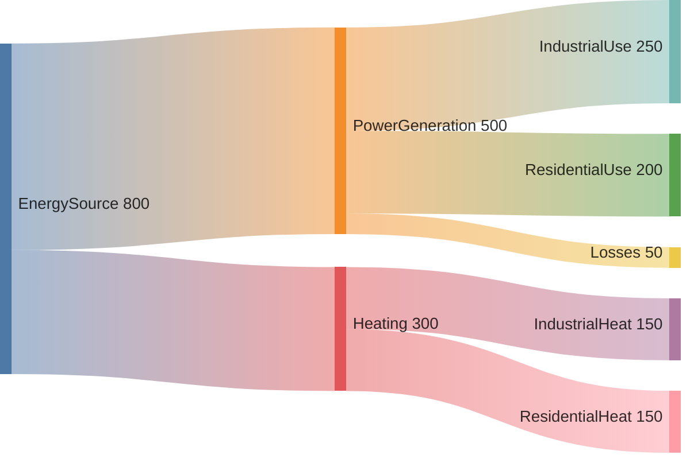
```mermaid
sankey-beta
EnergySource,PowerGeneration,500
EnergySource,Heating,300
PowerGeneration,IndustrialUse,250
PowerGeneration,ResidentialUse,200
PowerGeneration,Losses,50
Heating,IndustrialHeat,150
Heating,ResidentialHeat,150
```

### 标签样式 (`labelStyle`, v11.15.0+)

* **`legacy`**: 默认样式，纯文本标签。
* **`outlined`**: 带背景描边的标签，提高可读性。

### 节点尺寸 (`nodeWidth` 和 `nodePadding`, v11.15.0+)

* **`nodeWidth`**: 节点矩形宽度（像素），默认 `10`。
* **`nodePadding`**: 节点间垂直间距（像素），默认 `12`。

### 自定义节点颜色 (`nodeColors`, v11.15.0+)

可以为特定节点指定颜色：

```html
<script>
  const config = {
    startOnLoad: true,
    securityLevel: 'loose',
    sankey: {
      nodeColors: [
        '#FF6B6B',  // 第一个节点颜色
        '#4ECDC4',  // 第二个节点颜色
        '#45B7D1',  // 第三个节点颜色
        '#96CEB4',  // 第四个节点颜色
      ]
    },
  };
  mermaid.initialize(config);
</script>
```

## 15. XY 轴图 (XY Chart)

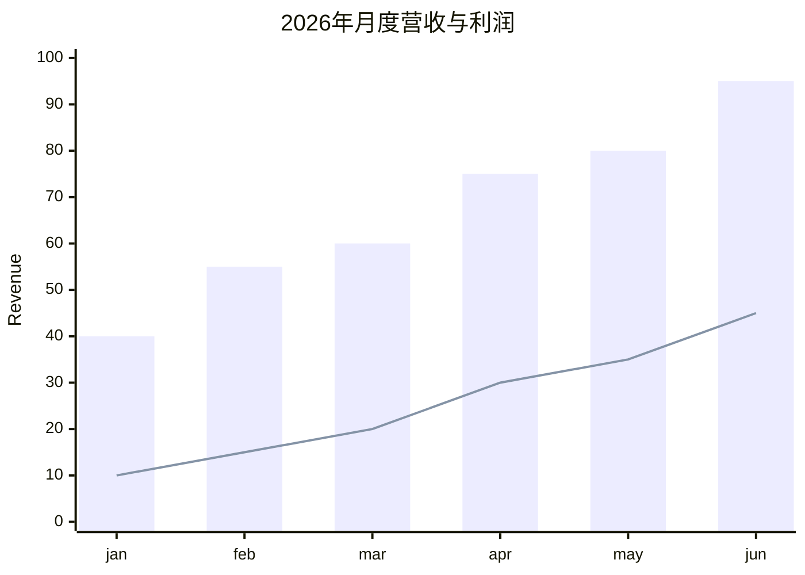
```mermaid
xychart-beta
    title "2026年月度营收与利润"
    x-axis [jan, feb, mar, apr, may, jun]
    y-axis "Revenue" 0 --> 100
    bar [40, 55, 60, 75, 80, 95]
    line [10, 15, 20, 30, 35, 45]
```

## 16. 块级架构图 (Block Diagram)

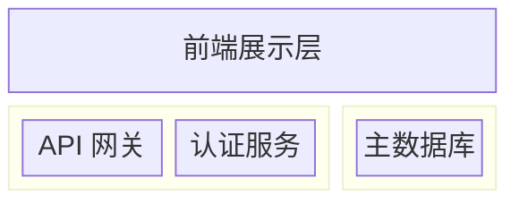
```mermaid
block
    columns 3
    doc["前端展示层"]:3

    block:group1:2
        columns 2
        A["API 网关"] B["认证服务"]
    end

    block:group2:1
        C["主数据库"]
    end
```

## 17. 需求图 (Requirement Diagram)

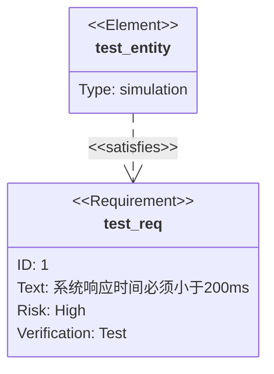
```mermaid
requirementDiagram

    requirement test_req {
        id: 1
        text: "系统响应时间必须小于200ms"
        risk: high
        verifymethod: test
    }

    element test_entity {
        type: simulation
    }

    test_entity - satisfies -> test_req
```

## 18. 网络数据包图 (Packet Diagram)

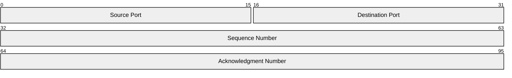
```mermaid
packet-beta
0-15: "Source Port"
16-31: "Destination Port"
32-63: "Sequence Number"
64-95: "Acknowledgment Number"

```

## 19. 架构图 (Architecture Diagram)

```mermaid
architecture-beta
    group api(cloud)[API Services]

    service db(database)[Database] in api
    service disk(disk)[Storage] in api
    service server(server)[App Server]

    server:L -- R:db
    server:B -- T:disk

```

## 20. 看板图 (Kanban Diagram)

```mermaid
kanban
  Todo
    [需求分析]
    [技术选型]
  InProgress
    id1[前端开发]@{ assigned: 'Alice', priority: 'High' }
    id2[后端开发]@{ assigned: 'Bob', priority: 'High' }
  Review
    id3[代码审查]@{ ticket: 'PROJ-101', assigned: 'Charlie' }
  Done
    id4[项目立项]
    id5[环境搭建]
```

## 21. 鱼骨图 / 因果图 (Ishikawa / Fishbone Diagram)

```mermaid
ishikawa-beta
    网站响应缓慢
    服务器
        CPU 使用率过高
        内存不足
        磁盘 I/O 瓶颈
    网络
        带宽不足
        DNS 解析慢
    数据库
        查询未优化
        索引缺失
        连接池耗尽
    应用代码
        N+1 查询问题
        内存泄漏
        未使用缓存
```

## 22. 韦恩图 (Venn Diagram)

```mermaid
venn-beta
    set A["前端技能"]
    set B["后端技能"]
    union A,B["全栈能力"]
```

## 23. 雷达图 (Radar Chart)

```mermaid
radar-beta
    title Team Skill Assessment
    axis Coding, Communication, Teamwork, ProblemSolving, Innovation
    curve ZhangSan{85, 70, 90, 80, 75}
    curve LiSi{70, 85, 75, 90, 80}
```

# Reference

- [Mermaid 官方文档](https://mermaid.js.org/syntax/flowchart.html)
- [Mermaid Chart是一个在线工具，让用户通过简单的文本代码和AI快速创建各种专业图表，如流程图和序列图。](https://www.mermaidchart.com/app/projects/8fdff60c-2a2c-470a-ab5d-536d0fb0b6cf/diagrams/08e94010-88f6-4bd1-88c7-5b2752d979af/version/v0.1/edit)
- [Mermaid Live Editor(Github) 本地编辑，预览和共享Mermaid图表。](https://github.com/mermaid-js/mermaid-live-editor?tab=readme-ov-file)