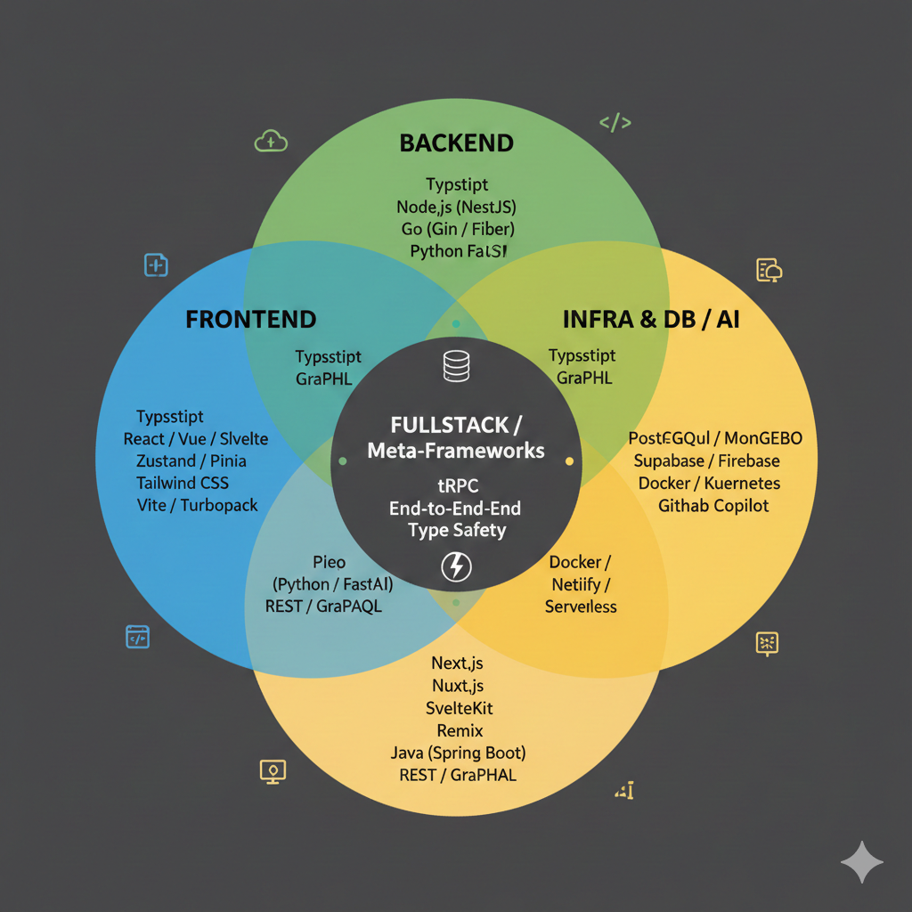

TechStack
=====

在 2026 年，Web 开发技术已经进入了“全栈化”和“AI 赋能”的深水区。TypeScript
已经从可选项变成了事实上的行业标准，而元框架（Meta-frameworks）则成为了构建应用的首选方案。

以下是 2026 年流行技术列表，分为前端、后端、全栈以及关键的周边生态：

---

## 1. 前端技术 (Frontend)

**核心关注：** 极致的用户体验、编译时优化、类型安全、组件模块化。

| 类别       | 核心技术 / 框架                                | 备注                             |
|----------|------------------------------------------|--------------------------------|
| **基础语言** | **TypeScript**, JavaScript (ES2025+)     | 纯 JS 在大型项目中已不多见，TS 是标配。        |
| **三大框架** | **React 19+**, **Vue.js 3.5+**, Angular  | React 仍是市场老大，Vue 在国内生态极强。      |
| **新兴力量** | **Svelte**, SolidJS, Qwik                | 追求“零运行时”和极速首屏加载。               |
| **状态管理** | **Zustand**, Pinia (Vue), TanStack Query | Redux 已退居二线，轻量化和数据同步是主流。       |
| **样式方案** | **Tailwind CSS**, CSS Modules, Shadcn/ui | 实用类优先（Utility-first）和组件库组合是主流。 |
| **构建工具** | **Vite**, Turbopack, Biome               | Webpack 几乎已成为历史，现在的目标是“秒开”。    |

---

## 2. 后端技术 (Backend)

**核心关注：** 高并发、高可用、开发效率、微服务与 Serverless 适配。

| 类别             | 核心技术 / 框架                    | 备注                              |
|----------------|------------------------------|---------------------------------|
| **Node.js 生态** | **NestJS**, Fastify, Express | NestJS 因其类 Java 的结构在大型项目中倍受欢迎。  |
| **Go 语言**      | Gin, Fiber, Echo             | 因其高性能和并发模型，在云原生和微服务中占据高地。       |
| **Python 生态**  | **FastAPI**, Django, Flask   | 结合 AI 应用的首选，FastAPI 凭借异步特性成为新宠。 |
| **Java 生态**    | **Spring Boot 3**, Quarkus   | 依然是金融和大型企业应用的金标准。               |
| **新兴/高性能**     | **Rust (Axum/Actix)**        | 追求极致性能和内存安全的场景（如中间件）。           |
| **API 协议**     | **REST**, **GraphQL**, gRPC  | GraphQL 在复杂前端取数场景下依然流行。         |

---

## 3. 全栈技术 (Full-Stack)

**核心关注：** 模糊前后端边界、端到端类型安全、开发闭环。

目前最流行的全栈方案是 **“元框架 + 托管平台”**，即通过一个框架同时编写前端 UI 和后端逻辑。

* **Next.js (React 系):** 全栈开发的“绝对统治者”，支持 React Server Components (RSC)，深度集成 Vercel。
* **Nuxt.js (Vue 系):** Vue 生态下的全栈首选，体验极佳。
* **SvelteKit:** 极致的性能和简洁的语法。
* **T3 Stack:** (Next.js + TypeScript + Tailwind + tRPC) 强调端到端类型安全。
* **Remix:** 强调 Web 标准和数据加载优化，已被 Shopify 收购并大规模应用。

---

## 4. 基础设施与数据库 (Infra & DB)

**核心关注：** 开发效率提升和运维简化。

* **数据库:** **PostgreSQL** (关系型首选), MongoDB (文档型), Redis (缓存), Pinecone (向量数据库，AI 必备)。
* **BaaS (后端即服务):** **Supabase**, Appwrite, Firebase (让开发者无需手写后端逻辑即可拥有数据库和认证)。
* **部署与云:** Vercel, Netlify, Docker + Kubernetes (容器化), AWS Lambda (Serverless)。
* **AI 辅助:** GitHub Copilot, Cursor, Vercel v0 (通过自然语言直接生成全栈代码)。

---

# Reference

