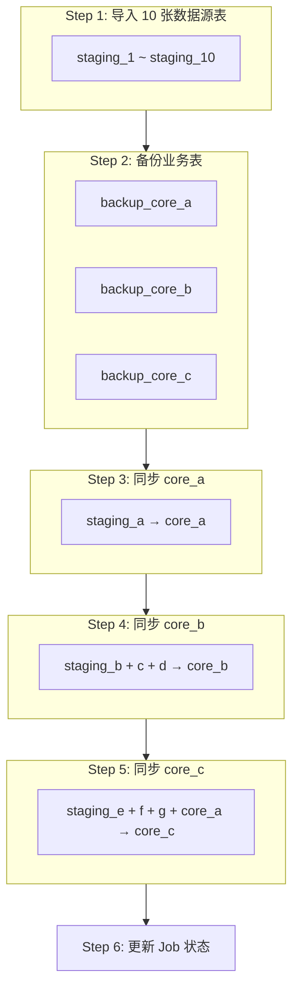
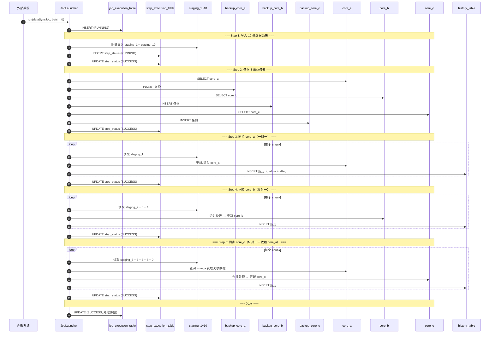

# PostgreSQL 多表数据同步 Batch 设计

## 一、整体架构

### 数据流向

```
10 张数据源表 ──→ 3 张核心业务表（有顺序依赖）
```

### 业务表依赖关系

| 业务表 | 映射关系 | 数据来源 | 依赖 |
|--------|----------|----------|------|
| **core_a** | 1:1 | staging_a | 无 |
| **core_b** | N:1 | staging_b + staging_c + staging_d | 无 |
| **core_c** | N:1 | staging_e + staging_f + staging_g + core_a | 依赖 core_a |

### 执行流程



---

## 二、表结构设计

### 数据源表（10 张）

```sql
-- staging_1: 一对一 → core_a
CREATE TABLE staging_1 (
    id              BIGSERIAL PRIMARY KEY,
    business_key    VARCHAR(64) NOT NULL,
    col_a1          VARCHAR(200),
    col_a2          NUMERIC(15,2),
    col_a3          TIMESTAMP,
    sync_batch_id   VARCHAR(64) NOT NULL,
    created_at      TIMESTAMP DEFAULT NOW()
);

-- staging_2 ~ staging_4: 多对一 → core_b
CREATE TABLE staging_2 (
    id              BIGSERIAL PRIMARY KEY,
    business_key    VARCHAR(64) NOT NULL,
    col_b1          VARCHAR(200),
    col_b2          NUMERIC(15,2),
    sync_batch_id   VARCHAR(64) NOT NULL,
    created_at      TIMESTAMP DEFAULT NOW()
);

CREATE TABLE staging_3 (
    id              BIGSERIAL PRIMARY KEY,
    business_key    VARCHAR(64) NOT NULL,
    col_b3          VARCHAR(100),
    col_b4          TIMESTAMP,
    sync_batch_id   VARCHAR(64) NOT NULL,
    created_at      TIMESTAMP DEFAULT NOW()
);

CREATE TABLE staging_4 (
    id              BIGSERIAL PRIMARY KEY,
    business_key    VARCHAR(64) NOT NULL,
    col_b5          VARCHAR(50),
    col_b6          NUMERIC(10,2),
    sync_batch_id   VARCHAR(64) NOT NULL,
    created_at      TIMESTAMP DEFAULT NOW()
);

-- staging_5 ~ staging_9: 多对一 → core_c（需要关联 core_a）
CREATE TABLE staging_5 (
    id              BIGSERIAL PRIMARY KEY,
    business_key    VARCHAR(64) NOT NULL,
    col_c1          VARCHAR(200),
    col_c2          NUMERIC(15,2),
    sync_batch_id   VARCHAR(64) NOT NULL,
    created_at      TIMESTAMP DEFAULT NOW()
);

CREATE TABLE staging_6 (
    id              BIGSERIAL PRIMARY KEY,
    business_key    VARCHAR(64) NOT NULL,
    col_c3          VARCHAR(100),
    col_c4          TIMESTAMP,
    sync_batch_id   VARCHAR(64) NOT NULL,
    created_at      TIMESTAMP DEFAULT NOW()
);

CREATE TABLE staging_7 (
    id              BIGSERIAL PRIMARY KEY,
    business_key    VARCHAR(64) NOT NULL,
    col_c5          VARCHAR(50),
    col_c6          NUMERIC(10,2),
    sync_batch_id   VARCHAR(64) NOT NULL,
    created_at      TIMESTAMP DEFAULT NOW()
);

CREATE TABLE staging_8 (
    id              BIGSERIAL PRIMARY KEY,
    business_key    VARCHAR(64) NOT NULL,
    col_c7          VARCHAR(200),
    col_c8          INTEGER,
    sync_batch_id   VARCHAR(64) NOT NULL,
    created_at      TIMESTAMP DEFAULT NOW()
);

CREATE TABLE staging_9 (
    id              BIGSERIAL PRIMARY KEY,
    business_key    VARCHAR(64) NOT NULL,
    col_c9          VARCHAR(100),
    col_c10         TIMESTAMP,
    sync_batch_id   VARCHAR(64) NOT NULL,
    created_at      TIMESTAMP DEFAULT NOW()
);

-- staging_10: 独立数据源（供其他业务逻辑使用）
CREATE TABLE staging_10 (
    id              BIGSERIAL PRIMARY KEY,
    business_key    VARCHAR(64) NOT NULL,
    col_x1          VARCHAR(200),
    col_x2          NUMERIC(15,2),
    sync_batch_id   VARCHAR(64) NOT NULL,
    created_at      TIMESTAMP DEFAULT NOW()
);

-- 所有 staging 表添加索引
CREATE INDEX idx_staging1_batch ON staging_1(sync_batch_id);
CREATE INDEX idx_staging2_batch ON staging_2(sync_batch_id);
CREATE INDEX idx_staging3_batch ON staging_3(sync_batch_id);
CREATE INDEX idx_staging4_batch ON staging_4(sync_batch_id);
CREATE INDEX idx_staging5_batch ON staging_5(sync_batch_id);
CREATE INDEX idx_staging6_batch ON staging_6(sync_batch_id);
CREATE INDEX idx_staging7_batch ON staging_7(sync_batch_id);
CREATE INDEX idx_staging8_batch ON staging_8(sync_batch_id);
CREATE INDEX idx_staging9_batch ON staging_9(sync_batch_id);
CREATE INDEX idx_staging10_batch ON staging_10(sync_batch_id);
```

### 核心业务表（3 张）

```sql
-- core_a: 一对一，来源于 staging_1
CREATE TABLE core_a (
    id              BIGSERIAL PRIMARY KEY,
    business_key    VARCHAR(64) NOT NULL UNIQUE,
    col_a1          VARCHAR(200),
    col_a2          NUMERIC(15,2),
    col_a3          TIMESTAMP,
    version         INTEGER DEFAULT 1,
    updated_at      TIMESTAMP DEFAULT NOW(),
    created_at      TIMESTAMP DEFAULT NOW()
);

-- core_b: 多对一，来源于 staging_2 + staging_3 + staging_4
CREATE TABLE core_b (
    id              BIGSERIAL PRIMARY KEY,
    business_key    VARCHAR(64) NOT NULL UNIQUE,
    col_b1          VARCHAR(200),
    col_b2          NUMERIC(15,2),
    col_b3          VARCHAR(100),
    col_b4          TIMESTAMP,
    col_b5          VARCHAR(50),
    col_b6          NUMERIC(10,2),
    version         INTEGER DEFAULT 1,
    updated_at      TIMESTAMP DEFAULT NOW(),
    created_at      TIMESTAMP DEFAULT NOW()
);

-- core_c: 多对一，来源于 staging_5~9 + core_a
CREATE TABLE core_c (
    id              BIGSERIAL PRIMARY KEY,
    business_key    VARCHAR(64) NOT NULL UNIQUE,
    col_a1_ref      VARCHAR(200),       -- 引用 core_a.col_a1
    col_c1          VARCHAR(200),
    col_c2          NUMERIC(15,2),
    col_c3          VARCHAR(100),
    col_c4          TIMESTAMP,
    col_c5          VARCHAR(50),
    col_c6          NUMERIC(10,2),
    col_c7          VARCHAR(200),
    col_c8          INTEGER,
    col_c9          VARCHAR(100),
    col_c10         TIMESTAMP,
    version         INTEGER DEFAULT 1,
    updated_at      TIMESTAMP DEFAULT NOW(),
    created_at      TIMESTAMP DEFAULT NOW()
);

CREATE INDEX idx_core_a_key ON core_a(business_key);
CREATE INDEX idx_core_b_key ON core_b(business_key);
CREATE INDEX idx_core_c_key ON core_c(business_key);
```

### 备份表（3 张）

```sql
CREATE TABLE backup_core_a (
    id              BIGSERIAL PRIMARY KEY,
    business_key    VARCHAR(64) NOT NULL,
    col_a1          VARCHAR(200),
    col_a2          NUMERIC(15,2),
    col_a3          TIMESTAMP,
    version         INTEGER,
    backup_batch_id VARCHAR(64) NOT NULL,
    backed_up_at    TIMESTAMP DEFAULT NOW()
);

CREATE TABLE backup_core_b (
    id              BIGSERIAL PRIMARY KEY,
    business_key    VARCHAR(64) NOT NULL,
    col_b1          VARCHAR(200),
    col_b2          NUMERIC(15,2),
    col_b3          VARCHAR(100),
    col_b4          TIMESTAMP,
    col_b5          VARCHAR(50),
    col_b6          NUMERIC(10,2),
    version         INTEGER,
    backup_batch_id VARCHAR(64) NOT NULL,
    backed_up_at    TIMESTAMP DEFAULT NOW()
);

CREATE TABLE backup_core_c (
    id              BIGSERIAL PRIMARY KEY,
    business_key    VARCHAR(64) NOT NULL,
    col_a1_ref      VARCHAR(200),
    col_c1          VARCHAR(200),
    col_c2          NUMERIC(15,2),
    col_c3          VARCHAR(100),
    col_c4          TIMESTAMP,
    col_c5          VARCHAR(50),
    col_c6          NUMERIC(10,2),
    col_c7          VARCHAR(200),
    col_c8          INTEGER,
    col_c9          VARCHAR(100),
    col_c10         TIMESTAMP,
    version         INTEGER,
    backup_batch_id VARCHAR(64) NOT NULL,
    backed_up_at    TIMESTAMP DEFAULT NOW()
);

CREATE INDEX idx_backup_a_batch ON backup_core_a(backup_batch_id);
CREATE INDEX idx_backup_b_batch ON backup_core_b(backup_batch_id);
CREATE INDEX idx_backup_c_batch ON backup_core_c(backup_batch_id);
```

### 履历表

```sql
CREATE TABLE history_table (
    id              BIGSERIAL PRIMARY KEY,
    target_table    VARCHAR(50) NOT NULL,       -- core_a / core_b / core_c
    business_key    VARCHAR(64) NOT NULL,
    before_data     JSONB,                      -- 更新前数据快照
    after_data      JSONB,                      -- 更新后数据快照
    change_type     VARCHAR(20) NOT NULL,       -- INSERT / UPDATE / DELETE
    sync_batch_id   VARCHAR(64) NOT NULL,
    created_at      TIMESTAMP DEFAULT NOW()
);

CREATE INDEX idx_history_batch ON history_table(sync_batch_id);
CREATE INDEX idx_history_table ON history_table(target_table);
CREATE INDEX idx_history_key ON history_table(business_key);
```

### Job 管理表

```sql
CREATE TABLE job_execution_table (
    id              BIGSERIAL PRIMARY KEY,
    job_name        VARCHAR(100) NOT NULL,
    batch_id        VARCHAR(64) NOT NULL UNIQUE,
    status          VARCHAR(20) NOT NULL,       -- RUNNING / SUCCESS / FAILED
    phase           VARCHAR(50),                -- 当前执行阶段
    total_count     INTEGER DEFAULT 0,
    success_count   INTEGER DEFAULT 0,
    fail_count      INTEGER DEFAULT 0,
    skip_count      INTEGER DEFAULT 0,
    error_message   TEXT,
    error_detail    TEXT,
    started_at      TIMESTAMP,
    finished_at     TIMESTAMP,
    created_at      TIMESTAMP DEFAULT NOW()
);

CREATE INDEX idx_job_batch ON job_execution_table(batch_id);
```

### Step 执行明细表

```sql
CREATE TABLE step_execution_table (
    id              BIGSERIAL PRIMARY KEY,
    batch_id        VARCHAR(64) NOT NULL,
    step_name       VARCHAR(100) NOT NULL,      -- import_staging / backup / sync_core_a ...
    status          VARCHAR(20) NOT NULL,       -- RUNNING / SUCCESS / FAILED
    read_count      INTEGER DEFAULT 0,
    write_count     INTEGER DEFAULT 0,
    commit_count    INTEGER DEFAULT 0,
    skip_count      INTEGER DEFAULT 0,
    error_message   TEXT,
    started_at      TIMESTAMP,
    finished_at     TIMESTAMP,
    created_at      TIMESTAMP DEFAULT NOW()
);

CREATE INDEX idx_step_batch ON step_execution_table(batch_id);
```

---

## 三、核心流程时序图



---

## 四、Batch 实现代码

### 1. Job 配置

```java
@Configuration
@EnableBatchProcessing
public class MultiTableSyncBatchConfig {

    @Bean
    public Job multiTableSyncJob(
            JobCompletionNotificationListener listener,
            Step step1ImportStaging,
            Step step2BackupAll,
            Step step3SyncCoreA,
            Step step4SyncCoreB,
            Step step5SyncCoreC) {
        return jobBuilder.get("multiTableSyncJob")
                .incrementer(new RunIdIncrementer())
                .listener(listener)
                .start(step1ImportStaging)
                .next(step2BackupAll)
                .next(step3SyncCoreA)
                .next(step4SyncCoreB)
                .next(step5SyncCoreC)
                .build();
    }
}
```

### 2. Step 1: 批量导入 10 张数据源表

```java
@Bean
public Step step1ImportStaging() {
    return stepBuilder.get("step1ImportStaging")
        .tasklet((contribution, chunkContext) -> {
            String batchId = getBatchId(chunkContext);
            Phase phase = Phase.IMPORT_STAGING;
            updateStepStatus(batchId, phase, "RUNNING");

            try {
                // 并行导入 10 张 staging 表
                List<String> stagingTables = List.of(
                    "staging_1", "staging_2", "staging_3", "staging_4",
                    "staging_5", "staging_6", "staging_7", "staging_8",
                    "staging_9", "staging_10"
                );

                for (String table : stagingTables) {
                    importStagingTable(table, batchId);
                }

                updateStepStatus(batchId, phase, "SUCCESS");
            } catch (Exception e) {
                updateStepStatus(batchId, phase, "FAILED", e.getMessage());
                throw e;
            }
            return RepeatStatus.FINISHED;
        })
        .build();
}

private void importStagingTable(String tableName, String batchId) {
    String sql = String.format("""
        INSERT INTO %s (business_key, sync_batch_id, created_at)
        SELECT business_key, :batchId, NOW()
        FROM staging_source
        WHERE target_table = :tableName AND sync_batch_id = :batchId
    """, tableName);
    jdbcTemplate.update(sql, Map.of("batchId", batchId, "tableName", tableName));
}
```

### 3. Step 2: 备份 3 张业务表

```java
@Bean
public Step step2BackupAll() {
    return stepBuilder.get("step2BackupAll")
        .tasklet((contribution, chunkContext) -> {
            String batchId = getBatchId(chunkContext);
            Phase phase = Phase.BACKUP;
            updateStepStatus(batchId, phase, "RUNNING");

            try {
                backupTable("core_a", "backup_core_a", batchId);
                backupTable("core_b", "backup_core_b", batchId);
                backupTable("core_c", "backup_core_c", batchId);
                updateStepStatus(batchId, phase, "SUCCESS");
            } catch (Exception e) {
                updateStepStatus(batchId, phase, "FAILED", e.getMessage());
                throw e;
            }
            return RepeatStatus.FINISHED;
        })
        .build();
}

private void backupTable(String sourceTable, String backupTable, String batchId) {
    String sql = String.format("""
        INSERT INTO %s (business_key, version, backup_batch_id, backed_up_at)
        SELECT business_key, version, :batchId, NOW()
        FROM %s
        WHERE business_key IN (
            SELECT business_key FROM staging_1 WHERE sync_batch_id = :batchId
            UNION
            SELECT business_key FROM staging_2 WHERE sync_batch_id = :batchId
            UNION
            SELECT business_key FROM staging_3 WHERE sync_batch_id = :batchId
            UNION
            SELECT business_key FROM staging_4 WHERE sync_batch_id = :batchId
            UNION
            SELECT business_key FROM staging_5 WHERE sync_batch_id = :batchId
            UNION
            SELECT business_key FROM staging_6 WHERE sync_batch_id = :batchId
            UNION
            SELECT business_key FROM staging_7 WHERE sync_batch_id = :batchId
            UNION
            SELECT business_key FROM staging_8 WHERE sync_batch_id = :batchId
            UNION
            SELECT business_key FROM staging_9 WHERE sync_batch_id = :batchId
        )
    """, backupTable, sourceTable);
    jdbcTemplate.update(sql, Map.of("batchId", batchId));
}
```

### 4. Step 3: 同步 core_a（一对一）

```java
@Bean
public Step step3SyncCoreA(
        ItemReader<Staging1Data> reader,
        ItemProcessor<Staging1Data, CoreAData> processor,
        ItemWriter<SyncResult> writer) {
    return stepBuilder.get("step3SyncCoreA")
        .<Staging1Data, SyncResult>chunk(500)
        .reader(reader)
        .processor(processor)
        .writer(writer)
        .faultTolerant()
        .retryLimit(3)
        .retry(DataAccessException.class)
        .skipLimit(50)
        .skip(InvalidDataException.class)
        .build();
}

// reader: 读取 staging_1 WHERE sync_batch_id = :batchId
// processor: staging_1 → core_a（一对一映射）
// writer: 写入 core_a + history_table
```

### 5. Step 4: 同步 core_b（N 对一）

```java
@Bean
public Step step4SyncCoreB() {
    return stepBuilder.get("step4SyncCoreB")
        .tasklet((contribution, chunkContext) -> {
            String batchId = getBatchId(chunkContext);
            Phase phase = Phase.SYNC_CORE_B;
            updateStepStatus(batchId, phase, "RUNNING");

            try {
                String sql = """
                    INSERT INTO core_b (business_key, col_b1, col_b2, col_b3, 
                                        col_b4, col_b5, col_b6, updated_at)
                    SELECT 
                        s2.business_key,
                        s2.col_b1,
                        s2.col_b2,
                        s3.col_b3,
                        s3.col_b4,
                        s4.col_b5,
                        s4.col_b6,
                        NOW()
                    FROM staging_2 s2
                    LEFT JOIN staging_3 s3 ON s2.business_key = s3.business_key 
                        AND s3.sync_batch_id = :batchId
                    LEFT JOIN staging_4 s4 ON s2.business_key = s4.business_key 
                        AND s4.sync_batch_id = :batchId
                    WHERE s2.sync_batch_id = :batchId
                    ON CONFLICT (business_key) DO UPDATE SET
                        col_b1 = EXCLUDED.col_b1,
                        col_b2 = EXCLUDED.col_b2,
                        col_b3 = EXCLUDED.col_b3,
                        col_b4 = EXCLUDED.col_b4,
                        col_b5 = EXCLUDED.col_b5,
                        col_b6 = EXCLUDED.col_b6,
                        version = core_b.version + 1,
                        updated_at = NOW()
                """;
                int count = jdbcTemplate.update(sql, Map.of("batchId", batchId));

                // 记录履历
                insertHistory("core_b", batchId, count);
                updateStepStatus(batchId, phase, "SUCCESS");
                updateStepStats(batchId, phase, count);

            } catch (Exception e) {
                updateStepStatus(batchId, phase, "FAILED", e.getMessage());
                throw e;
            }
            return RepeatStatus.FINISHED;
        })
        .build();
}
```

### 6. Step 5: 同步 core_c（N 对一 + 依赖 core_a）

```java
@Bean
public Step step5SyncCoreC() {
    return stepBuilder.get("step5SyncCoreC")
        .tasklet((contribution, chunkContext) -> {
            String batchId = getBatchId(chunkContext);
            Phase phase = Phase.SYNC_CORE_C;
            updateStepStatus(batchId, phase, "RUNNING");

            try {
                String sql = """
                    INSERT INTO core_c (business_key, col_a1_ref,
                        col_c1, col_c2, col_c3, col_c4, col_c5, col_c6,
                        col_c7, col_c8, col_c9, col_c10, updated_at)
                    SELECT 
                        s5.business_key,
                        a.col_a1,               -- 关联 core_a
                        s5.col_c1,
                        s5.col_c2,
                        s6.col_c3,
                        s6.col_c4,
                        s7.col_c5,
                        s7.col_c6,
                        s8.col_c7,
                        s8.col_c8,
                        s9.col_c9,
                        s9.col_c10,
                        NOW()
                    FROM staging_5 s5
                    LEFT JOIN staging_6 s6 ON s5.business_key = s6.business_key 
                        AND s6.sync_batch_id = :batchId
                    LEFT JOIN staging_7 s7 ON s5.business_key = s7.business_key 
                        AND s7.sync_batch_id = :batchId
                    LEFT JOIN staging_8 s8 ON s5.business_key = s8.business_key 
                        AND s8.sync_batch_id = :batchId
                    LEFT JOIN staging_9 s9 ON s5.business_key = s9.business_key 
                        AND s9.sync_batch_id = :batchId
                    LEFT JOIN core_a a ON s5.business_key = a.business_key
                    WHERE s5.sync_batch_id = :batchId
                    ON CONFLICT (business_key) DO UPDATE SET
                        col_a1_ref = EXCLUDED.col_a1_ref,
                        col_c1 = EXCLUDED.col_c1,
                        col_c2 = EXCLUDED.col_c2,
                        col_c3 = EXCLUDED.col_c3,
                        col_c4 = EXCLUDED.col_c4,
                        col_c5 = EXCLUDED.col_c5,
                        col_c6 = EXCLUDED.col_c6,
                        col_c7 = EXCLUDED.col_c7,
                        col_c8 = EXCLUDED.col_c8,
                        col_c9 = EXCLUDED.col_c9,
                        col_c10 = EXCLUDED.col_c10,
                        version = core_c.version + 1,
                        updated_at = NOW()
                """;
                int count = jdbcTemplate.update(sql, Map.of("batchId", batchId));

                insertHistory("core_c", batchId, count);
                updateStepStatus(batchId, phase, "SUCCESS");
                updateStepStats(batchId, phase, count);

            } catch (Exception e) {
                updateStepStatus(batchId, phase, "FAILED", e.getMessage());
                throw e;
            }
            return RepeatStatus.FINISHED;
        })
        .build();
}
```

### 7. 履历记录方法

```java
private void insertHistory(String targetTable, String batchId, int count) {
    String sql = String.format("""
        INSERT INTO history_table 
            (target_table, business_key, after_data, change_type, sync_batch_id)
        SELECT 
            :targetTable,
            business_key,
            to_jsonb(%s),
            CASE 
                WHEN xmax = 0 THEN 'INSERT'
                ELSE 'UPDATE'
            END,
            :batchId
        FROM %s
        WHERE updated_at >= (
            SELECT started_at FROM job_execution_table WHERE batch_id = :batchId
        )
    """, targetTable, targetTable);
    jdbcTemplate.update(sql, Map.of(
        "targetTable", targetTable,
        "batchId", batchId
    ));
}
```

### 8. Job 监听器

```java
@Component
public class JobCompletionNotificationListener implements JobExecutionListener {

    @Autowired
    private JdbcTemplate jdbcTemplate;

    @Override
    public void afterJob(JobExecution jobExecution) {
        String batchId = jobExecution.getJobParameters().getString("batchId");
        BatchStatus status = jobExecution.getStatus();

        // 汇总所有 step 的处理件数
        Map<String, Object> stats = jdbcTemplate.queryForMap("""
            SELECT 
                SUM(read_count) as total_read,
                SUM(write_count) as total_write,
                SUM(skip_count) as total_skip
            FROM step_execution_table
            WHERE batch_id = ?
        """, batchId);

        // 更新 Job 管理表
        jdbcTemplate.update("""
            UPDATE job_execution_table 
            SET status = ?,
                total_count = ?,
                success_count = ?,
                fail_count = ?,
                skip_count = ?,
                error_message = ?,
                finished_at = NOW()
            WHERE batch_id = ?
        """,
            status.toString(),
            stats.get("total_write"),
            stats.get("total_write"),
            0,
            stats.get("total_skip"),
            status == BatchStatus.FAILED ? getExitMessage(jobExecution) : null,
            batchId
        );
    }
}
```

---

## 五、执行调用

```java
@Service
public class MultiTableSyncService {

    @Autowired
    private JobLauncher jobLauncher;

    @Autowired
    @Qualifier("multiTableSyncJob")
    private Job multiTableSyncJob;

    public String triggerSync(String externalBatchNo) throws Exception {
        String batchId = "MTS-" + UUID.randomUUID().toString().substring(0, 8);

        JobParameters params = new JobParametersBuilder()
                .addString("batchId", batchId)
                .addString("externalBatchNo", externalBatchNo)
                .addLong("timestamp", System.currentTimeMillis())
                .toJobParameters();

        jobLauncher.run(multiTableSyncJob, params);
        return batchId;
    }
}
```

---

## 六、错误处理策略

| 阶段 | 异常类型 | 处理方式 |
|------|----------|----------|
| 导入 staging | 数据格式错误 | 跳过该条，记录 skip_count |
| 备份 | 数据库异常 | 重试 3 次，失败则终止 |
| 同步 core_a | 重试 3 次 | 数据库连接/死锁 |
| 同步 core_b | 跳过 50 条 | 单条数据异常 |
| 同步 core_c | 跳过 50 条 | 单条数据异常 |

**核心原则：**
- **core_a 失败**：终止整个 Job（后续 core_c 依赖 core_a）
- **core_b 失败**：可选择继续 core_c 或终止
- **core_c 失败**：不影响已成功的 core_a 和 core_b

---

## 七、查询示例

### 查询 Job 执行状态

```sql
SELECT 
    j.batch_id,
    j.job_name,
    j.status,
    j.phase,
    j.total_count,
    j.success_count,
    j.fail_count,
    j.started_at,
    j.finished_at,
    j.finished_at - j.started_at AS duration
FROM job_execution_table j
ORDER BY j.created_at DESC
LIMIT 20;
```

### 查询各 Step 执行明细

```sql
SELECT 
    s.step_name,
    s.status,
    s.read_count,
    s.write_count,
    s.skip_count,
    s.error_message,
    s.started_at,
    s.finished_at
FROM step_execution_table s
WHERE s.batch_id = 'MTS-xxxxxxxx'
ORDER BY s.started_at;
```

### 查询失败记录

```sql
SELECT 
    h.target_table,
    h.business_key,
    h.change_type,
    h.after_data,
    h.created_at
FROM history_table h
WHERE h.sync_batch_id = 'MTS-xxxxxxxx'
  AND h.change_type = 'SKIP'
ORDER BY h.created_at;
```

---

## 八、关键设计要点

| 要点 | 说明 |
|------|------|
| **执行顺序** | core_a → core_b → core_c，确保依赖关系正确 |
| **core_c 依赖 core_a** | 通过 LEFT JOIN core_a 获取关联数据 |
| **备份先行** | Step 2 一次性备份所有业务表 |
| **幂等性** | `ON CONFLICT DO UPDATE` 保证重复执行安全 |
| **JSONB 履历** | 使用 JSONB 存储 before/after 快照，灵活且高效 |
| **Step 明细表** | 每个 Step 独立记录执行状态，便于问题定位 |
| **phase 字段** | Job 管理表记录当前阶段，支持断点续跑 |
