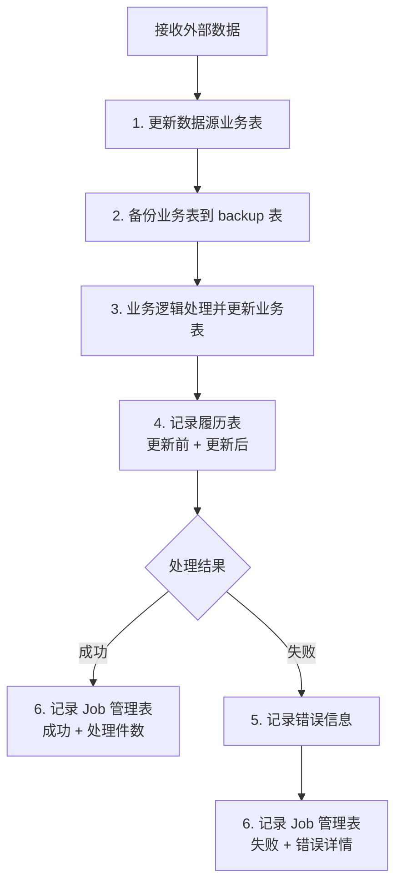
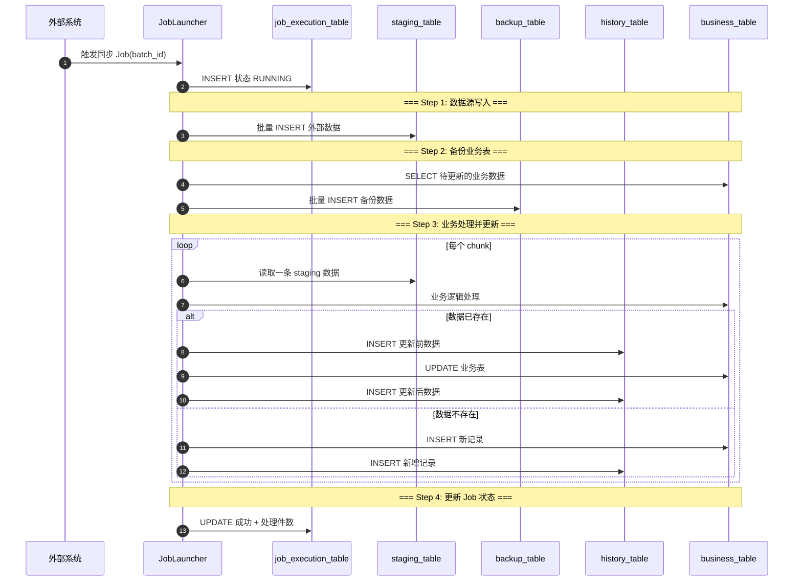

# PostgreSQL 数据同步 Batch 设计

## 一、整体架构



---

## 二、表结构设计

### 1. 数据源业务表（staging_table）

外部数据写入此表，作为同步的数据源。

```sql
CREATE TABLE staging_table (
    id              BIGSERIAL PRIMARY KEY,
    business_key    VARCHAR(64) NOT NULL,       -- 业务主键
    field_a         VARCHAR(200),
    field_b         NUMERIC(15,2),
    field_c         TIMESTAMP,
    field_d         VARCHAR(50),
    sync_batch_id   VARCHAR(64) NOT NULL,       -- 同批次标识
    created_at      TIMESTAMP DEFAULT NOW()
);

CREATE INDEX idx_staging_batch ON staging_table(sync_batch_id);
```

### 2. 业务表（business_table）

核心业务数据表，由 batch 同步更新。

```sql
CREATE TABLE business_table (
    id              BIGSERIAL PRIMARY KEY,
    business_key    VARCHAR(64) NOT NULL UNIQUE,
    field_a         VARCHAR(200),
    field_b         NUMERIC(15,2),
    field_c         TIMESTAMP,
    field_d         VARCHAR(50),
    version         INTEGER DEFAULT 1,          -- 乐观锁版本号
    updated_at      TIMESTAMP DEFAULT NOW(),
    created_at      TIMESTAMP DEFAULT NOW()
);

CREATE INDEX idx_business_key ON business_table(business_key);
```

### 3. 备份表（backup_table）

每次更新前，将业务表当前数据备份到此表。

```sql
CREATE TABLE backup_table (
    id              BIGSERIAL PRIMARY KEY,
    business_key    VARCHAR(64) NOT NULL,
    field_a         VARCHAR(200),
    field_b         NUMERIC(15,2),
    field_c         TIMESTAMP,
    field_d         VARCHAR(50),
    version         INTEGER,
    backup_batch_id VARCHAR(64) NOT NULL,       -- 备份批次标识
    backed_up_at    TIMESTAMP DEFAULT NOW()
);

CREATE INDEX idx_backup_batch ON backup_table(backup_batch_id);
```

### 4. 履历表（history_table）

记录每次更新的变更前/变更后数据。

```sql
CREATE TABLE history_table (
    id              BIGSERIAL PRIMARY KEY,
    business_key    VARCHAR(64) NOT NULL,
    field_a_before  VARCHAR(200),
    field_a_after   VARCHAR(200),
    field_b_before  NUMERIC(15,2),
    field_b_after   NUMERIC(15,2),
    field_c_before  TIMESTAMP,
    field_c_after   TIMESTAMP,
    field_d_before  VARCHAR(50),
    field_d_after   VARCHAR(50),
    change_type     VARCHAR(20) NOT NULL,       -- INSERT / UPDATE / DELETE
    sync_batch_id   VARCHAR(64) NOT NULL,
    created_at      TIMESTAMP DEFAULT NOW()
);

CREATE INDEX idx_history_batch ON history_table(sync_batch_id);
CREATE INDEX idx_history_key ON history_table(business_key);
```

### 5. Job 管理表（job_execution_table）

记录每次 batch 执行的结果。

```sql
CREATE TABLE job_execution_table (
    id              BIGSERIAL PRIMARY KEY,
    job_name        VARCHAR(100) NOT NULL,
    batch_id        VARCHAR(64) NOT NULL UNIQUE, -- 批次唯一标识
    status          VARCHAR(20) NOT NULL,       -- RUNNING / SUCCESS / FAILED
    total_count     INTEGER DEFAULT 0,          -- 总处理件数
    success_count   INTEGER DEFAULT 0,          -- 成功件数
    fail_count      INTEGER DEFAULT 0,          -- 失败件数
    skip_count      INTEGER DEFAULT 0,          -- 跳过件数
    error_message   TEXT,                       -- 错误信息
    error_detail    TEXT,                       -- 错误堆栈
    started_at      TIMESTAMP,
    finished_at     TIMESTAMP,
    created_at      TIMESTAMP DEFAULT NOW()
);

CREATE INDEX idx_job_batch ON job_execution_table(batch_id);
```

---

## 三、核心流程时序图



---

## 四、Batch 实现代码

### 1. Job 配置

```java
@Configuration
@EnableBatchProcessing
public class DataSyncBatchConfig {

    @Bean
    public Job dataSyncJob(
            JobCompletionNotificationListener listener,
            Step step1ImportStaging,
            Step step2Backup,
            Step step3SyncBusiness) {
        return jobBuilder.get("dataSyncJob")
                .incrementer(new RunIdIncrementer())
                .listener(listener)
                .start(step1ImportStaging)
                .next(step2Backup)
                .next(step3SyncBusiness)
                .build();
    }
}
```

### 2. Step 1: 导入数据源表

```java
@Bean
public Step step1ImportStaging(JdbcBatchItemWriter<Map<String, Object>> stagingWriter) {
    return stepBuilder.get("step1ImportStaging")
            .<Map<String, Object>, Map<String, Object>>chunk(500)
            .reader(stagingReader(null))
            .writer(stagingWriter)
            .faultTolerant()
            .skipLimit(100)
            .skip(FlatFileParseException.class)
            .build();
}
```

### 3. Step 2: 备份业务表

```java
@Bean
public Step step2Backup() {
    return stepBuilder.get("step2Backup")
            .tasklet((contribution, chunkContext) -> {
                String batchId = (String) chunkContext.getStepContext()
                        .getJobParameters().get("batchId");
                
                String sql = """
                    INSERT INTO backup_table 
                        (business_key, field_a, field_b, field_c, field_d, 
                         version, backup_batch_id)
                    SELECT 
                        business_key, field_a, field_b, field_c, field_d,
                        version, :batchId
                    FROM business_table
                    WHERE business_key IN (
                        SELECT business_key FROM staging_table 
                        WHERE sync_batch_id = :batchId
                    )
                """;
                
                jdbcTemplate.update(sql, Map.of("batchId", batchId));
                return RepeatStatus.FINISHED;
            })
            .build();
}
```

### 4. Step 3: 业务同步处理

```java
@Bean
public Step step3SyncBusiness(
        ItemReader<StagingData> reader,
        ItemProcessor<StagingData, SyncResult> processor,
        ItemWriter<SyncResult> writer) {
    return stepBuilder.get("step3SyncBusiness")
            .<StagingData, SyncResult>chunk(200)
            .reader(reader)
            .processor(processor)
            .writer(writer)
            .faultTolerant()
            .retryLimit(3)
            .retry(DataAccessException.class)
            .skipLimit(50)
            .skip(InvalidDataException.class)
            .build();
}
```

### 5. ItemProcessor: 业务逻辑处理

```java
@Component
public class SyncProcessor implements ItemProcessor<StagingData, SyncResult> {

    @Autowired
    private JdbcTemplate jdbcTemplate;

    @Override
    public SyncResult process(StagingData staging) throws Exception {
        // 1. 查询业务表当前数据（更新前）
        BusinessData before = queryBusinessData(staging.getBusinessKey());

        // 2. 业务逻辑处理
        BusinessData after = applyBusinessLogic(staging, before);

        // 3. 构建结果
        SyncResult result = new SyncResult();
        result.setBusinessKey(staging.getBusinessKey());
        result.setBefore(before);
        result.setAfter(after);
        result.setChangeType(before == null ? "INSERT" : "UPDATE");

        return result;
    }

    private BusinessData applyBusinessLogic(StagingData staging, BusinessData existing) {
        // 业务规则处理
        BusinessData result = new BusinessData();
        result.setBusinessKey(staging.getBusinessKey());
        result.setFieldA(staging.getFieldA());
        result.setFieldB(calculateFieldB(staging));  // 业务计算
        result.setFieldC(staging.getFieldC());
        result.setFieldD(determineFieldD(staging));  // 业务判断
        return result;
    }
}
```

### 6. ItemWriter: 写入业务表 + 履历表

```java
@Component
public class SyncWriter implements ItemWriter<SyncResult> {

    @Autowired
    private JdbcTemplate jdbcTemplate;

    @Override
    public void write(Chunk<? extends SyncResult> chunk) throws Exception {
        List<? extends SyncResult> items = chunk.getItems();

        for (SyncResult result : items) {
            try {
                // 1. 写入履历表（更新前）
                if ("UPDATE".equals(result.getChangeType())) {
                    insertHistory(result.getBefore(), result, "BEFORE");
                }

                // 2. 更新或插入业务表
                if ("INSERT".equals(result.getChangeType())) {
                    insertBusiness(result.getAfter());
                } else {
                    updateBusiness(result.getAfter());
                }

                // 3. 写入履历表（更新后）
                insertHistory(result.getAfter(), result, "AFTER");

            } catch (DataAccessException e) {
                log.error("处理失败: key={}", result.getBusinessKey(), e);
                throw e;  // 触发重试/跳过
            }
        }
    }

    private void insertHistory(BusinessData data, SyncResult result, String changeType) {
        String sql = """
            INSERT INTO history_table 
                (business_key, field_a, field_b, field_c, field_d, 
                 change_type, sync_batch_id)
            VALUES (?, ?, ?, ?, ?, ?, ?)
        """;
        jdbcTemplate.update(sql,
                data.getBusinessKey(), data.getFieldA(), data.getFieldB(),
                data.getFieldC(), data.getFieldD(), changeType,
                result.getBatchId());
    }
}
```

### 7. Job 监听器: 记录执行结果

```java
@Component
public class JobCompletionNotificationListener implements JobExecutionListener {

    @Autowired
    private JdbcTemplate jdbcTemplate;

    @Override
    public void afterJob(JobExecution jobExecution) {
        String batchId = jobExecution.getJobParameters().getString("batchId");
        JobInstance instance = jobExecution.getJobInstance();
        BatchStatus status = jobExecution.getStatus();

        // 统计处理件数
        Map<String, Object> stats = jdbcTemplate.queryForMap("""
            SELECT 
                COUNT(*) as total,
                SUM(CASE WHEN change_type = 'INSERT' THEN 1 ELSE 0 END) as inserts,
                SUM(CASE WHEN change_type = 'UPDATE' THEN 1 ELSE 0 END) as updates
            FROM history_table 
            WHERE sync_batch_id = ?
        """, batchId);

        // 更新 Job 管理表
        String sql = """
            UPDATE job_execution_table 
            SET status = ?,
                total_count = ?,
                success_count = ?,
                fail_count = ?,
                error_message = ?,
                finished_at = NOW()
            WHERE batch_id = ?
        """;

        String errorMsg = jobExecution.getStatus() == BatchStatus.FAILED
                ? getExitMessage(jobExecution) : null;

        jdbcTemplate.update(sql,
                status.toString(),
                stats.get("total"),
                stats.get("total"),   // 成功 = 总数 - 失败
                0,
                errorMsg,
                batchId);
    }

    private String getExitMessage(JobExecution jobExecution) {
        return jobExecution.getStepExecutions().stream()
                .filter(s -> s.getStatus() == BatchStatus.FAILED)
                .map(StepExecution::getExitStatus)
                .map(ExitStatus::getExitDescription)
                .findFirst()
                .orElse("Unknown error");
    }
}
```

---

## 五、执行调用示例

```java
@Service
public class DataSyncService {

    @Autowired
    private JobLauncher jobLauncher;

    @Autowired
    @Qualifier("dataSyncJob")
    private Job dataSyncJob;

    public String triggerSync(String外部批次号) throws Exception {
        String batchId = "SYNC-" + UUID.randomUUID().toString().substring(0, 8);

        JobParameters params = new JobParametersBuilder()
                .addString("batchId", batchId)
                .addString("externalBatchNo", 外部批次号)
                .addLong("timestamp", System.currentTimeMillis())
                .toJobParameters();

        jobLauncher.run(dataSyncJob, params);
        return batchId;
    }
}
```

---

## 六、错误处理策略

| 异常类型 | 处理方式 | 说明 |
|----------|----------|------|
| `DataAccessException` | 重试 3 次 | 数据库连接/死锁等临时性故障 |
| `InvalidDataException` | 跳过并记录 | 数据格式错误，不影响其他记录 |
| `BusinessException` | 跳过并记录 | 业务规则校验失败 |
| `Exception` | 终止 Job | 未知异常，整体失败 |

**失败数据隔离：**
- 跳过的数据记录到 `history_table`，`change_type = 'SKIP'`
- 错误详情写入 `job_execution_table.error_detail`
- 支持通过 `batch_id` 重新执行失败批次

---

## 七、Job 管理表查询

### 查询 Job 执行历史

```sql
SELECT 
    batch_id,
    job_name,
    status,
    total_count,
    success_count,
    fail_count,
    error_message,
    started_at,
    finished_at,
    finished_at - started_at AS duration
FROM job_execution_table
ORDER BY created_at DESC
LIMIT 20;
```

### 查询失败明细

```sql
SELECT 
    j.batch_id,
    j.error_message,
    h.business_key,
    h.change_type,
    h.created_at
FROM job_execution_table j
JOIN history_table h ON h.sync_batch_id = j.batch_id
WHERE j.status = 'FAILED'
ORDER BY j.created_at DESC;
```

---

## 八、关键设计要点

1. **幂等性**：通过 `business_key` + `sync_batch_id` 确保重复执行安全
2. **备份先行**：Step 2 先完成备份，再执行更新，确保可恢复
3. **履历完整**：更新前/后数据分别记录，支持审计和回溯
4. **事务边界**：每个 chunk 一个事务，平衡性能和一致性
5. **乐观锁**：`business_table.version` 防止并发更新冲突
6. **批次追踪**：`batch_id` 贯穿全流程，支持问题定位和重跑
