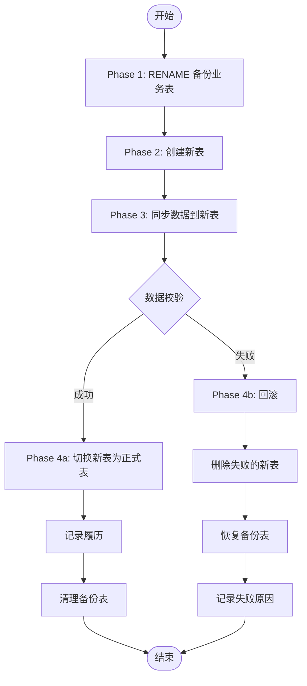
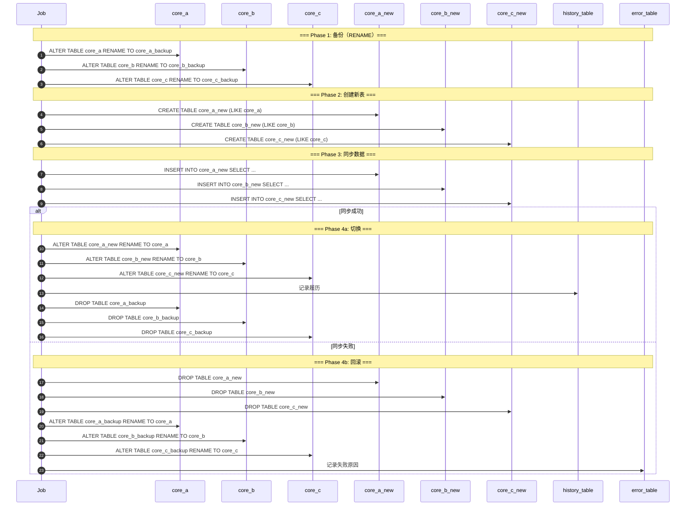
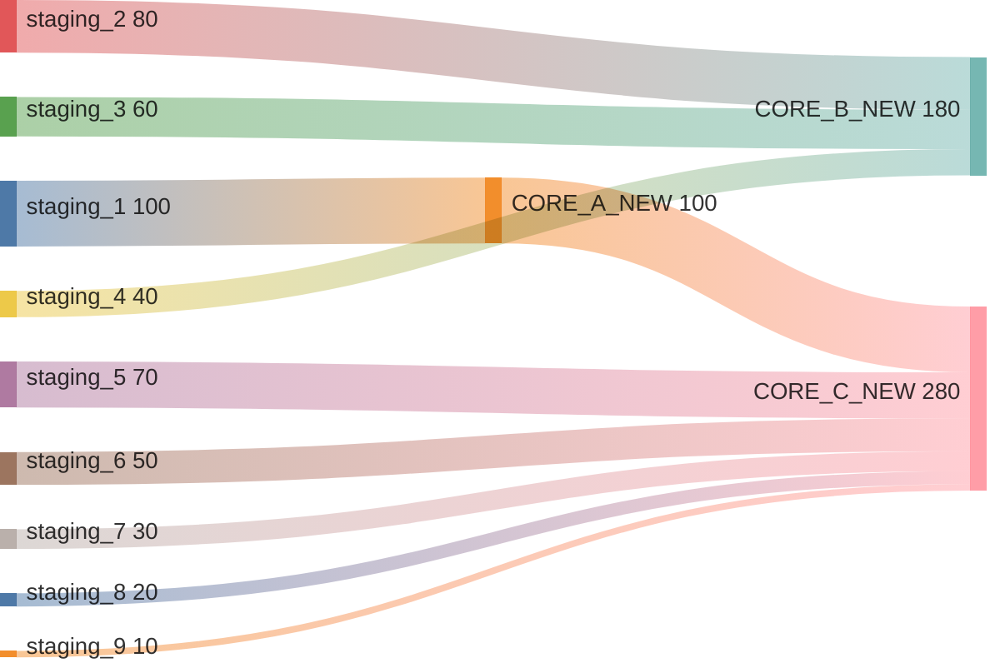

# Shadow Table Sync Job 设计方案

## 一、方案概述

采用 **备份→新建→同步→切换/回滚** 的原子操作策略，确保数据同步过程中的事务一致性。

### 核心流程

```
RENAME 备份 → 新建表 → 同步数据 → 成功：切换 / 失败：回滚
```

### 方案优势

| 特性 | 说明 |
|------|------|
| **原子性** | 整个切换过程要么全部成功，要么全部回滚 |
| **零停机** | 切换时间在毫秒级 |
| **自动回滚** | 失败时自动恢复原表 |
| **完整履历** | 成功/失败都记录详细信息 |

---

## 二、架构设计

### 流程图



### 时序图



### 数据流向（Sankey Diagram）



---

## 三、表结构设计

### 管理表

```sql
-- 同步管理表
CREATE TABLE shadow_sync_management (
    id              BIGSERIAL PRIMARY KEY,
    batch_id        VARCHAR(64) NOT NULL UNIQUE,
    status          VARCHAR(20) NOT NULL,   -- RUNNING / SUCCESS / FAILED
    sync_timestamp  VARCHAR(20) NOT NULL,   -- 同步时间戳，如 20260917120000
    error_message   TEXT,
    started_at      TIMESTAMP DEFAULT NOW(),
    finished_at     TIMESTAMP
);

CREATE INDEX idx_shadow_sync_batch ON shadow_sync_management(batch_id);
CREATE INDEX idx_shadow_sync_status ON shadow_sync_management(status);
```

### 履历表

```sql
CREATE TABLE shadow_sync_history (
    id              BIGSERIAL PRIMARY KEY,
    batch_id        VARCHAR(64) NOT NULL,
    operation       VARCHAR(20) NOT NULL,   -- BACKUP / CREATE / SYNC / SWITCH / ROLLBACK
    target_table    VARCHAR(50) NOT NULL,
    before_data     JSONB,
    after_data      JSONB,
    row_count       INTEGER,
    executed_at     TIMESTAMP DEFAULT NOW()
);

CREATE INDEX idx_shadow_history_batch ON shadow_sync_history(batch_id);
```

### 错误表

```sql
CREATE TABLE shadow_sync_error (
    id              BIGSERIAL PRIMARY KEY,
    batch_id        VARCHAR(64) NOT NULL,
    error_phase     VARCHAR(50) NOT NULL,   -- BACKUP / CREATE / SYNC / SWITCH
    target_table    VARCHAR(50),
    error_message   TEXT NOT NULL,
    error_stack     TEXT,
    created_at      TIMESTAMP DEFAULT NOW()
);

CREATE INDEX idx_shadow_error_batch ON shadow_sync_error(batch_id);
```

---

## 四、实现代码

### 1. Job 配置

```java
@Configuration
@EnableBatchProcessing
public class ShadowSyncBatchConfig {

    @Bean
    public Job shadowSyncJob(Step stepAtomicSyncWithRollback) {
        return jobBuilder.get("shadowSyncJob")
                .incrementer(new RunIdIncrementer())
                .start(stepAtomicSyncWithRollback)
                .build();
    }
}
```

### 2. 主流程 Step

```java
@Bean
public Step stepAtomicSyncWithRollback() {
    return stepBuilder.get("stepAtomicSyncWithRollback")
        .tasklet((contribution, chunkContext) -> {
            String batchId = getBatchId(chunkContext);
            String syncTimestamp = generateSyncTimestamp();
            
            // 创建管理记录
            jdbcTemplate.update("""
                INSERT INTO shadow_sync_management (batch_id, status, sync_timestamp)
                VALUES (?, 'RUNNING', ?)
            """, batchId, syncTimestamp);
            
            try {
                // Phase 1: 备份（RENAME 原表 → 备份表）
                backupTables(batchId, syncTimestamp);
                
                // Phase 2: 创建新表
                createNewTables(batchId, syncTimestamp);
                
                // Phase 3: 同步数据到新表
                syncDataToNewTables(batchId, syncTimestamp);
                
                // Phase 4a: 成功 → 切换新表为正式表
                switchNewTablesToProduction(syncTimestamp);
                
                // 更新状态为成功
                updateStatus(batchId, "SUCCESS");
                
                // 清理备份表
                cleanupBackupTables(syncTimestamp);
                
            } catch (Exception e) {
                // Phase 4b: 失败 → 回滚
                rollbackTables(batchId, syncTimestamp);
                
                // 记录失败原因
                recordError(batchId, getCurrentPhase(e), e);
                
                throw e;
            }
            
            return RepeatStatus.FINISHED;
        })
        .build();
}

// 根据异常判断失败阶段
private String getCurrentPhase(Exception e) {
    String message = e.getMessage();
    if (message.contains("RENAME")) return "BACKUP";
    if (message.contains("CREATE TABLE")) return "CREATE";
    if (message.contains("INSERT")) return "SYNC";
    return "UNKNOWN";
}
```

### 3. Phase 1: 备份

```java
private void backupTables(String batchId, String syncTimestamp) {
    Map<String, String> tables = deriveTableNames(syncTimestamp);
    
    // 备份 core_a
    jdbcTemplate.execute("ALTER TABLE core_a RENAME TO " + tables.get("core_a_backup"));
    recordOperation(batchId, "BACKUP", "core_a");
    
    // 备份 core_b
    jdbcTemplate.execute("ALTER TABLE core_b RENAME TO " + tables.get("core_b_backup"));
    recordOperation(batchId, "BACKUP", "core_b");
    
    // 备份 core_c
    jdbcTemplate.execute("ALTER TABLE core_c RENAME TO " + tables.get("core_c_backup"));
    recordOperation(batchId, "BACKUP", "core_c");
}
```

### 4. Phase 2: 创建新表

```java
private void createNewTables(String batchId, String syncTimestamp) {
    Map<String, String> tables = deriveTableNames(syncTimestamp);
    
    // 创建 core_a_new
    jdbcTemplate.execute("CREATE TABLE " + tables.get("core_a_new") + " (LIKE core_a INCLUDING ALL)");
    recordOperation(batchId, "CREATE", "core_a");
    
    // 创建 core_b_new
    jdbcTemplate.execute("CREATE TABLE " + tables.get("core_b_new") + " (LIKE core_b INCLUDING ALL)");
    recordOperation(batchId, "CREATE", "core_b");
    
    // 创建 core_c_new
    jdbcTemplate.execute("CREATE TABLE " + tables.get("core_c_new") + " (LIKE core_c INCLUDING ALL)");
    recordOperation(batchId, "CREATE", "core_c");
}
```

### 5. Phase 3: 同步数据

```java
private void syncDataToNewTables(String batchId, String syncTimestamp) {
    Map<String, String> tables = deriveTableNames(syncTimestamp);
    String newA = tables.get("core_a_new");
    String newB = tables.get("core_b_new");
    String newC = tables.get("core_c_new");
    
    // 同步 core_a_new
    int countA = jdbcTemplate.update("""
        INSERT INTO %s (business_key, col_a1, col_a2, col_a3)
        SELECT business_key, col_a1, col_a2, col_a3
        FROM staging_1
        WHERE sync_batch_id = ?
    """.formatted(newA), batchId);
    recordOperation(batchId, "SYNC", "core_a", countA);
    
    // 同步 core_b_new
    int countB = jdbcTemplate.update("""
        INSERT INTO %s (business_key, col_b1, col_b2, col_b3, col_b4, col_b5, col_b6)
        SELECT s2.business_key, s2.col_b1, s2.col_b2, s3.col_b3, s3.col_b4, s4.col_b5, s4.col_b6
        FROM staging_2 s2
        LEFT JOIN staging_3 s3 ON s2.business_key = s3.business_key
        LEFT JOIN staging_4 s4 ON s2.business_key = s4.business_key
        WHERE s2.sync_batch_id = ?
    """.formatted(newB), batchId);
    recordOperation(batchId, "SYNC", "core_b", countB);
    
    // 同步 core_c_new（依赖 core_a_new）
    int countC = jdbcTemplate.update("""
        INSERT INTO %s (business_key, col_a1_ref, col_c1, col_c2, col_c3, col_c4, col_c5, col_c6)
        SELECT s5.business_key, a.col_a1, s5.col_c1, s5.col_c2, s6.col_c3, s6.col_c4, s7.col_c5, s7.col_c6
        FROM staging_5 s5
        LEFT JOIN staging_6 s6 ON s5.business_key = s6.business_key
        LEFT JOIN staging_7 s7 ON s5.business_key = s7.business_key
        LEFT JOIN %s a ON s5.business_key = a.business_key
        WHERE s5.sync_batch_id = ?
    """.formatted(newC, newA), batchId);
    recordOperation(batchId, "SYNC", "core_c", countC);
}
```

### 6. Phase 4a: 成功切换

```java
private void switchNewTablesToProduction(String syncTimestamp) {
    Map<String, String> tables = deriveTableNames(syncTimestamp);
    
    // 切换 core_a
    jdbcTemplate.execute("ALTER TABLE " + tables.get("core_a_new") + " RENAME TO core_a");
    
    // 切换 core_b
    jdbcTemplate.execute("ALTER TABLE " + tables.get("core_b_new") + " RENAME TO core_b");
    
    // 切换 core_c
    jdbcTemplate.execute("ALTER TABLE " + tables.get("core_c_new") + " RENAME TO core_c");
}
```

### 7. Phase 4b: 失败回滚

```java
private void rollbackTables(String batchId, String syncTimestamp) {
    Map<String, String> tables = deriveTableNames(syncTimestamp);
    
    // 删除失败的新表
    safeDropTable(tables.get("core_a_new"));
    safeDropTable(tables.get("core_b_new"));
    safeDropTable(tables.get("core_c_new"));
    
    // 恢复备份表
    jdbcTemplate.execute("ALTER TABLE " + tables.get("core_a_backup") + " RENAME TO core_a");
    jdbcTemplate.execute("ALTER TABLE " + tables.get("core_b_backup") + " RENAME TO core_b");
    jdbcTemplate.execute("ALTER TABLE " + tables.get("core_c_backup") + " RENAME TO core_c");
    
    recordOperation(batchId, "ROLLBACK", "ALL", 0);
    updateStatus(batchId, "FAILED");
}

private void safeDropTable(String tableName) {
    try {
        if (tableName != null) {
            jdbcTemplate.execute("DROP TABLE IF EXISTS " + tableName);
        }
    } catch (Exception e) {
        log.warn("Failed to drop table: {}", tableName, e);
    }
}
```

### 8. 清理备份表

```java
private void cleanupBackupTables(String syncTimestamp) {
    Map<String, String> tables = deriveTableNames(syncTimestamp);
    
    safeDropTable(tables.get("core_a_backup"));
    safeDropTable(tables.get("core_b_backup"));
    safeDropTable(tables.get("core_c_backup"));
}
```

### 9. 辅助方法

```java
// 从 timestamp 推导所有表名
private Map<String, String> deriveTableNames(String syncTimestamp) {
    return Map.of(
        "core_a_backup", "core_a_backup_" + syncTimestamp,
        "core_b_backup", "core_b_backup_" + syncTimestamp,
        "core_c_backup", "core_c_backup_" + syncTimestamp,
        "core_a_new", "core_a_new_" + syncTimestamp,
        "core_b_new", "core_b_new_" + syncTimestamp,
        "core_c_new", "core_c_new_" + syncTimestamp
    );
}

// 生成 sync_timestamp
private String generateSyncTimestamp() {
    return LocalDateTime.now().format(
        DateTimeFormatter.ofPattern("yyyyMMddHHmmss"));
}

private void updateStatus(String batchId, String status) {
    jdbcTemplate.update("""
        UPDATE shadow_sync_management 
        SET status = ?, finished_at = NOW() 
        WHERE batch_id = ?
    """, status, batchId);
}

private void recordOperation(String batchId, String operation, String targetTable) {
    recordOperation(batchId, operation, targetTable, 0);
}

private void recordOperation(String batchId, String operation, String targetTable, int rowCount) {
    jdbcTemplate.update("""
        INSERT INTO shadow_sync_history (batch_id, operation, target_table, row_count)
        VALUES (?, ?, ?, ?)
    """, batchId, operation, targetTable, rowCount);
}

private void recordError(String batchId, String errorPhase, Exception e) {
    jdbcTemplate.update("""
        INSERT INTO shadow_sync_error (batch_id, error_phase, error_message, error_stack)
        VALUES (?, ?, ?, ?)
    """, batchId, errorPhase, e.getMessage(), Arrays.toString(e.getStackTrace()));
}
```

---

## 五、监控与查询

### 查询同步状态

```sql
SELECT 
    batch_id,
    status,
    sync_timestamp,
    error_message,
    started_at,
    finished_at,
    finished_at - started_at AS duration
FROM shadow_sync_management
ORDER BY started_at DESC
LIMIT 10;
```

### 查询操作履历

```sql
SELECT 
    batch_id,
    operation,
    target_table,
    after_data,
    row_count,
    executed_at
FROM shadow_sync_history
WHERE batch_id = 'xxx'
ORDER BY executed_at;
```

### 查询失败记录

```sql
SELECT 
    batch_id,
    error_phase,
    target_table,
    error_message,
    error_stack,
    created_at
FROM shadow_sync_error
WHERE batch_id = 'xxx';
```

### 自动清理旧备份表

```sql
-- 定时任务：清理 7 天前的备份表
CREATE OR REPLACE FUNCTION cleanup_old_backup_tables()
RETURNS void AS $$
DECLARE
    rec RECORD;
    table_name TEXT;
BEGIN
    FOR rec IN 
        SELECT sync_timestamp
        FROM shadow_sync_management
        WHERE status = 'SUCCESS'
          AND finished_at < NOW() - INTERVAL '7 days'
    LOOP
        -- 根据命名规范推导表名并删除
        table_name := 'core_a_backup_' || rec.sync_timestamp;
        EXECUTE 'DROP TABLE IF EXISTS ' || table_name;
        
        table_name := 'core_b_backup_' || rec.sync_timestamp;
        EXECUTE 'DROP TABLE IF EXISTS ' || table_name;
        
        table_name := 'core_c_backup_' || rec.sync_timestamp;
        EXECUTE 'DROP TABLE IF EXISTS ' || table_name;
    END LOOP;
END;
$$ LANGUAGE plpgsql;
```

---

## 六、异常处理策略

| 阶段 | 异常类型 | 处理方式 |
|------|----------|----------|
| Phase 1: 备份 | 表不存在 | 记录错误，跳过 |
| Phase 2: 创建 | 权限不足 | 回滚备份，记录错误 |
| Phase 3: 同步 | 数据校验失败 | 回滚备份，记录错误 |
| Phase 4a: 切换 | RENAME 冲突 | 回滚备份，记录错误 |

### 核心原则

1. **原子性**：Phase 4a 的 RENAME 操作在同一事务中完成
2. **幂等性**：支持重复执行，不会产生脏数据
3. **可追溯**：所有操作都记录到履历表和错误表
4. **自动恢复**：失败时自动回滚到原状态
