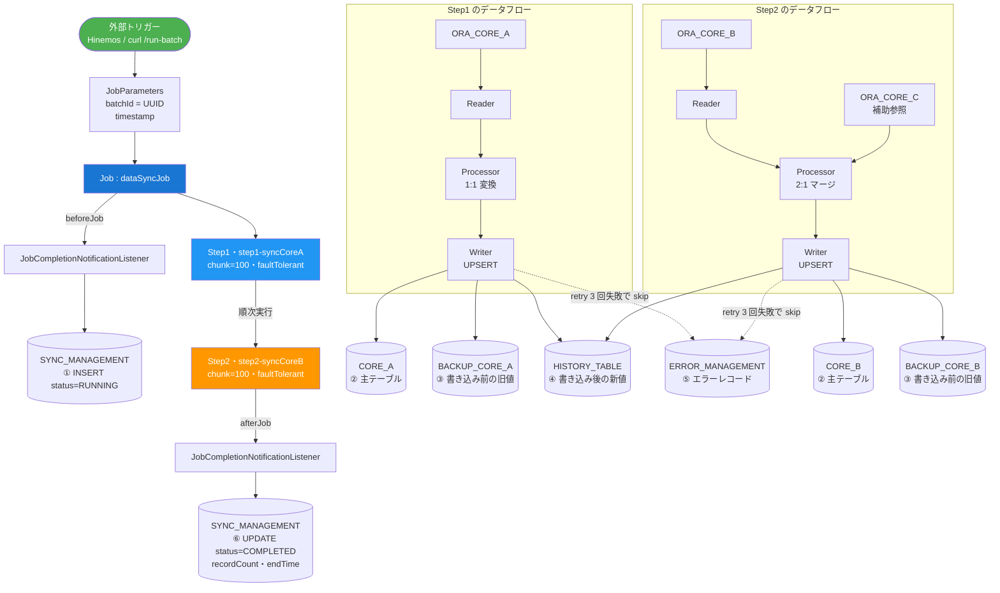
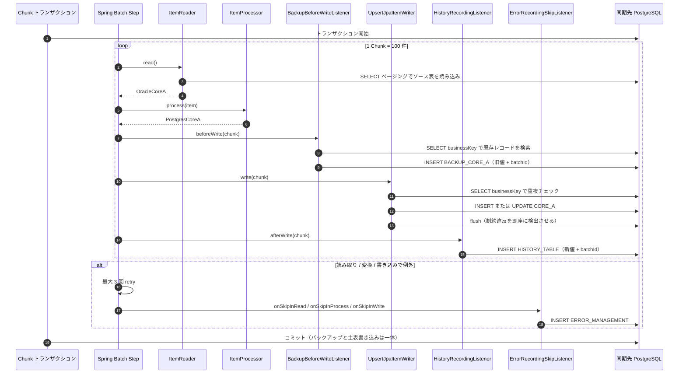
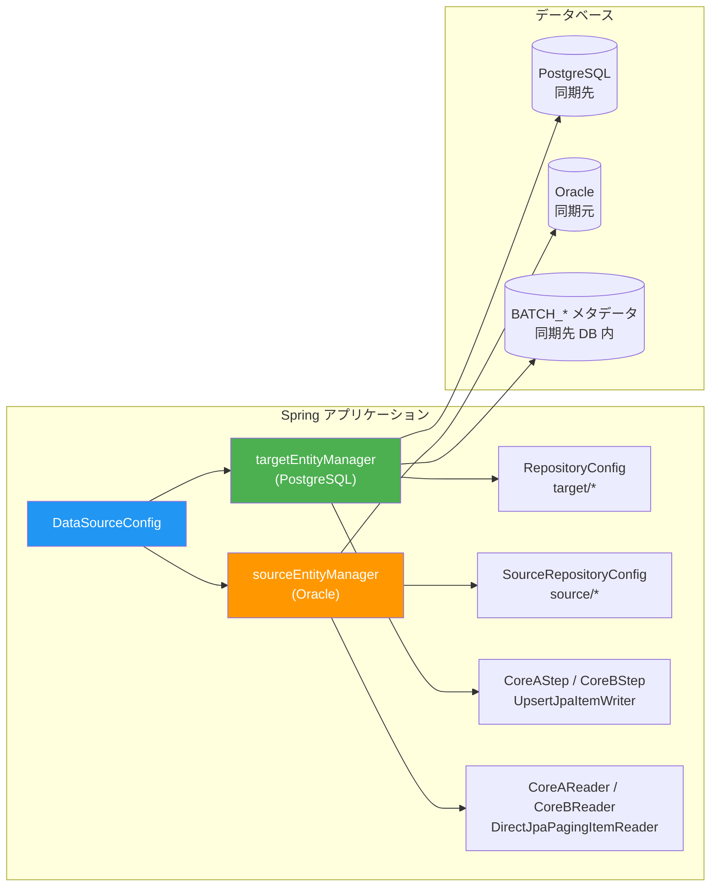

# DataSync POC

## 概要

本 POC は、Spring Batch で Oracle と PostgreSQL に直接接続し、データを同期する方式の検証用です。

## 動作環境

- Java 25
- Maven 3.8+
- PostgreSQL 14+（mock 環境では不要）
- Oracle 19c+（mock 環境では不要）

## プロファイル

| プロファイル | 環境 | データベース | 用途 |
|---------|------|--------|------|
| `dev` | ローカル開発 | Oracle + PostgreSQL | 開発・デバッグ |
| `stg` | ステージング | Oracle + PostgreSQL | リリース前テスト |
| `prod` | 本番 | Oracle + PostgreSQL | 本番環境 |
| `mock` | Mock 環境 | H2 ファイルデータベース | DB なしでの検証 |

## バッチ処理の説明

### 1. 全体の処理フロー

`①`〜`⑥` は 1 回の同期における書き込み順序です。点線は異常系の流れです。すべての書き込みが同じ `batchId` を共有するため、テーブルをまたいで追跡できます。

### 2. 1 Chunk 内の処理シーケンス

1 Chunk（100 件）内の書き込みは**すべて同一トランザクション**で、全件コミットまたは全件ロールバックです。

### 3. 型変換（Oracle → PostgreSQL）

すべての Processor は直接代入せず、必ず `TypeConverter` を通します。両 DB の型体系は等価ではなく、フィールドを 1 対 1 で対応させても「動いているように見える」だけで、特定のデータで問題が発生します。

| 型 | Oracle | PostgreSQL | 対処しないと | メソッド |
|------|--------|------------|--------------|------|
| 文字列 | `CHAR(n)` は固定長で不足分を右側空白埋め | `varchar` は埋めない | 余分な空白が同期先に入る | `toText(v, maxLen)` |
| 文字列 | `''` は NULL と等価 | `''` と NULL を厳密に区別 | 同期先に NULL と空文字が混在 | `toText(v, maxLen)` |
| 文字列 | `VARCHAR2(4000)` | `VARCHAR(200)` | INSERT 時に value too long | `toText(v, maxLen)`（切り詰め + WARN） |
| 数値 | `NUMBER` は小数桁が不定 | `NUMERIC(p,s)` | 小数桁が揃わない | `toNumeric(v, scale)` |
| 数値 | 桁あふれする値 | `NUMERIC(15,2)` | 暗黙のうちに切り詰められる | `toNumeric(v, p, s)`（例外 → skip 記録） |
| 数値 | `NUMBER(10)` / `NUMBER(5)` | `INTEGER` / `SMALLINT` | 小数部が黙って丸められる | `toInteger(v)` / `toShort(v)` |
| 数値 | `BINARY_DOUBLE` / `BINARY_FLOAT` | `DOUBLE PRECISION` / `REAL` | 精度の意味が異なる | `toDouble(v)` / `toFloat(v)` |
| 日時 | `TIMESTAMP` はナノ秒(9 桁)まで | `timestamp` はマイクロ秒(6 桁)まで | ドライバがエラー、または暗黙の四捨五入 | `toTimestamp(v)` |
| 日付 | `DATE` は時刻を含む | `date` / `timestamp` | 時刻が落ちる、または補われる | `toDate(v)` / `toTimestamp(v)` |
| 日時 | `TIMESTAMP WITH TIME ZONE` | `timestamptz` | タイムゾーン／精度が失われる | `toOffsetDateTime(v)` |
| 真偽値 | boolean なし。`CHAR(1)` の Y/N か `NUMBER(1)` の 1/0 で代用 | `boolean` | 型不一致 | `toBoolean(v)` |
| バイナリ | `BLOB` / `RAW` | `BYTEA` | 型不一致 | `toBytes(v)` |

同期対象のテーブルを追加する場合も同様に、すべてのフィールドを `TypeConverter` に通してください（型が同じフィールドも対応メソッドを呼ぶだけで済み、コストは無視できる程度です。将来型を変更しても漏れません）。汎用エントリ `TypeConverter.convert(value, TargetType.class)` も利用できます（`String` / `BigDecimal` / `Integer` / `Long` / `Short` / `Double` / `Float` / `Boolean` / `LocalDate` / `LocalDateTime` / `OffsetDateTime` / `byte[]` に対応）。

> データ異常（精度あふれ、小数付きの整数、解釈できない真偽値）は**すべて `IllegalArgumentException` をスロー**し、fault-tolerant の retry/skip で捕捉して `ERROR_MANAGEMENT` に書き込みます。暗黙の切り詰めや丸めは行いません。

#### 全型検証カラム

`ORA_CORE_A` → `CORE_A` → `BACKUP_CORE_A` の 3 テーブルには、1 対 1 で対応する「全型検証カラム」があり、変換結果を E2E で検証できます。

| カラム | Oracle（ソース） | PostgreSQL（ターゲット） | 検証ポイント |
|------|--------|--------|------|
| `COL_VARCHAR2` | `VARCHAR2(100)` | `VARCHAR(100)` | 前後の空白を strip |
| `COL_CHAR` | `CHAR(10)` 固定長で空白埋め | `VARCHAR(10)` | 右側の埋め空白が除去される |
| `COL_NVARCHAR2` | `NVARCHAR2(100)` | `VARCHAR(100)` | マルチバイト文字 |
| `COL_CLOB` | `CLOB` | `TEXT` | ラージオブジェクト → テキスト |
| `COL_TRUNCATE` | `VARCHAR2(200)` | `VARCHAR(20)` | 長すぎる場合の切り詰め + WARN |
| `COL_NUMBER` | `NUMBER(15,2)` | `NUMERIC(15,2)` | 精度・小数桁の調整 |
| `COL_NUMBER_RAW` | `NUMBER`（精度指定なし） | `NUMERIC(15,4)` | scale の調整（四捨五入） |
| `COL_INTEGER` | `NUMBER(10)` | `INTEGER` | 整数変換 |
| `COL_SMALLINT` | `NUMBER(5)` | `SMALLINT` | 小さい整数の変換 |
| `COL_BIGINT` | `NUMBER(19)` | `BIGINT` | 大きな整数の変換 |
| `COL_DOUBLE` | `BINARY_DOUBLE` | `DOUBLE PRECISION` | 倍精度 |
| `COL_REAL` | `BINARY_FLOAT` | `REAL` | 単精度 |
| `COL_NUM_FLAG` | `NUMBER(1)` 1/0 | `BOOLEAN` | 数値 → 真偽値 |
| `COL_CHAR_FLAG` | `CHAR(1)` Y/N | `BOOLEAN` | 文字 → 真偽値 |
| `COL_DATE` | `DATE` | `DATE` | 日付 |
| `COL_TIMESTAMP` | `TIMESTAMP` | `TIMESTAMP` | ナノ秒 → マイクロ秒 |
| `COL_TS_TO_DATE` | `TIMESTAMP` | `DATE` | 時刻部分を破棄 |
| `COL_DATE_TO_TS` | `DATE` | `TIMESTAMP` | `00:00:00` を補完 |
| `COL_TS_TZ` | `TIMESTAMP WITH TIME ZONE` | `TIMESTAMP WITH TIME ZONE` | オフセットを保持 |
| `COL_BLOB` | `BLOB` | `BYTEA` | ラージオブジェクトのバイナリ |
| `COL_RAW` | `RAW(32)` | `BYTEA` | 固定長バイナリ |

### テーブル一覧

| テーブル名 | 用途 | 操作 |
|------|------|------|
| `ORA_CORE_A` | Oracle 側データ A | SELECT |
| `ORA_CORE_B` | Oracle 側データ B | SELECT |
| `ORA_CORE_C` | Oracle 側データ C | SELECT |
| `CORE_A` | PostgreSQL 側データ A | INSERT/UPDATE |
| `CORE_B` | PostgreSQL 側データ B（B+C をマージ） | INSERT/UPDATE |
| `SYNC_MANAGEMENT` | 同期ジョブ管理 | INSERT/UPDATE |
| `BACKUP_CORE_A` | CoreA のバックアップ | INSERT |
| `BACKUP_CORE_B` | CoreB のバックアップ | INSERT |
| `HISTORY_TABLE` | 変更履歴 | INSERT |
| `ERROR_MANAGEMENT` | エラーレコード | INSERT |

## デュアルデータソース構成

## コアフロー

1. **起動**: Hinemos または `curl /run-batch` で Job を起動し、`batchId` を生成して `JobParameters` に格納
2. **登録**: `beforeJob` で `SYNC_MANAGEMENT` に `RUNNING` レコードを作成
3. **データ抽出**: `DirectJpaPagingItemReader` が Oracle からページングで読み込み
4. **データ変換**: `ItemProcessor` がフィールドマッピングとクレンジング（CoreA は 1:1、CoreB は CoreC と 2:1 マージ）
5. **書き込み前バックアップ**: `beforeWrite` で同期先に既存の旧値を `BACKUP_*` へ退避
6. **データ書き込み**: `UpsertJpaItemWriter` が `businessKey` で重複チェック後、`CORE_*` へ INSERT / UPDATE
7. **履歴生成**: `afterWrite` で書き込み後の新値を `HISTORY_TABLE` に記録
8. **完了処理**: `afterJob` で `SYNC_MANAGEMENT` を `COMPLETED` に更新し、件数と終了時刻を書き戻し

5〜7 は同一 chunk トランザクション内で実行されます。いずれかで例外が出た場合は 3 回 retry し、それでも失敗すれば skip して `ERROR_MANAGEMENT` に記録します。

## 主な特徴

- Chunk 単位のバッチ処理
- デュアルデータソースのトランザクション制御（読み取りは同期元接続、書き込みは `targetTransactionManager`）
- リトライ（3 回）とスキップ（上限 10）の仕組み
- エラー記録とリカバリ
- 実行履歴の記録
- 書き込み**前**の旧値自動バックアップ（`batchId` でロールバック可能）
- Batch メタデータの永続化（`BATCH_*` は同期先 DB に保存され、再起動しても実行履歴が消えない）

## 拡張ポイント

- 同期対象テーブルの追加
- 差分同期ロジックの実装
- データ検証ルールの追加
- 並列処理の実装
- 監視・アラート機能の追加
